# Rounding-Guided Backdoor Injection in Deep Learning Model Quantization

Xiangxiang Chen†, Peixin Zhang‡*, Jun $\mathbf { S u n } ^ { \ddagger }$ , Wenhai Wang†, Jingyi Wang†*

†Zhejiang University, ‡Singapore Management University

†{chenxiangx, zdzzlab, wangjyee}@zju.edu.cn, ‡pxzhang $\ 9 4 @$ gmail.com, ‡junsun@smu.edu.sg

Abstract—Model quantization is a popular technique for deploying deep learning models on resource-constrained environments. However, it may also introduce previously overlooked security risks. In this work, we present QURA, a novel backdoor attack that exploits model quantization to embed malicious behaviors. Unlike conventional backdoor attacks relying on training data poisoning or model training manipulation, QURA solely works using the quantization operations. In particular, QURA first employs a novel weight selection strategy to identify critical weights that influence the backdoor target (with the goal of perserving the model’s overall performance in mind). Then, by optimizing the rounding direction of these weights, we amplify the backdoor effect across model layers without degrading accuracy. Extensive experiments demonstrate that QURA achieves nearly $100 \%$ attack success rates in most cases, with negligible performance degradation. Furthermore, we show that QURA can adapt to bypass existing backdoor defenses, underscoring its threat potential. Our findings highlight critical vulnerability in widely used model quantization process, emphasizing the need for more robust security measures. Our implementation is available at https://github.com/cxx122/QuRA.

# I. INTRODUCTION

Deep learning (DL) models have revolutionized a wide range of applications, from computer vision (CV) [1], [2], [3], [4], [5] to natural language processing (NLP) [6], [7], [8]. However, as these models grow in size and complexity, deploying them on resource-constrained environments, such as edge devices or mobile platforms, has become increasingly challenging. For instance, the well-known model, BERT-Large [9], has 340 million parameters and requires over 10 GB of memory when deployed in full precision—far exceeding the RAM capacity of most mobile devices. Model quantization has emerged as a popular solution to address this issue, reducing both model size and computational demands, while enabling faster inference and lower energy consumption [10], [11].

The core idea of quantization is to reduce the precision of a model’s parameters and operations, typically from 32-bit floating-point to lower-bit representations such as 8-bit or 4- bit integers, while maintaining performance within acceptable

* Corresponding authors.

Network and Distributed System Security (NDSS) Symposium 2026 23 - 27 February 2026 , San Diego, CA, USA ISBN 979-8-9919276-8-0 https://dx.doi.org/10.14722/ndss.2026.230113 www.ndss-symposium.org

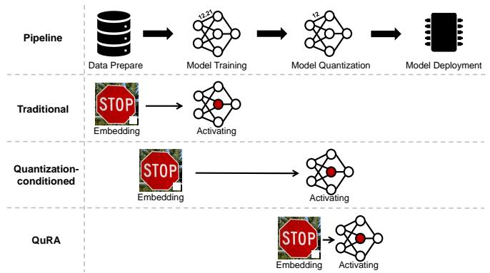  
Fig. 1: Traditional and quantization-conditioned backdoor attacks embed the backdoor during data preparation and training, activating it either during training or quantization. In contrast, our QURA method embeds and activates the backdoor exclusively during the quantization phase.

limits. This compression reduces both the model’s memory footprint and computational demands, making it more suitable for deployment on resource-constrained devices. A common practice for users is to upload a small calibration dataset1 associated with the model that needs to be quantized, providing it to quantization tools tailored to their specific requirements for bandwidth, storage, and accuracy [12], [13], [14]. However, the quantization process, which transforms high precision model weights into lower-bit representations, can inadvertently introduce vulnerabilities that may be exploited by adversaries.

The availability of open-source quantized models significantly amplifies supply chain attack risks. Platforms like Hugging Face, which host extensive repositories of pretrained models and quantization tools [15], create potential entry points for malicious actors. For instance, compromised quantization tools could silently inject backdoors during the model compression phase, leveraging user-provided calibration datasets to manipulate quantized weights without altering the original full-precision model.

Recent research at the intersection of backdoor attacks and model quantization has focused on triggers that activate exclusively after quantization. For instance, studies [14], [16] demonstrate quantization-conditioned backdoors that remain

1Once uploaded, the calibration dataset is no longer under the user’s control, as any subsequent modifications and usage are determined by the quantization algorithm itself.

dormant in full-precision models but become active once quantization is applied, highlighting risks in compression workflows. However, existing quantization-conditioned backdoor attacks rely on the model’s training process and encounter two critical limitations. First, these backdoors are highly sensitive to variations in the quantization process, such as changes in rounding direction or activation distributions, which can significantly reduce their effectiveness [14]. Second, attackers must control both the training and quantization processes simultaneously to implant and activate the backdoor, increasing the attack’s complexity and difficulty. These limitations lead us to further consider the following question: Could it be possible to implement a backdoor attack exclusively during the model quantization phase, without any reliance on or interference in the training process? In this work, we demonstrate that attackers can exploit vulnerabilities inherent in the deployment process—specifically during model quantization—to embed backdoors covertly and effectively. Our findings reveal that even during the post-training deployment stage, models are not entirely secure and remain susceptible to attacks.

We introduce QURA, a novel attack that sabotages deep learning model deployment by manipulating the rounding process during model quantization. Specifically, QURA has three key advantages that make it a particularly effective and covert method of attack: 1) Training-agnostic. Unlike prior backdoor attacks that require modifications during training, QURA operates entirely within the quantization phase (see Fig 1). This allows the attack to target any pre-trained model without access to its original training pipeline. 2) Stealthy. QURA produces quantized models that are visually and operationally indistinguishable from those generated by standard quantization tools. By quantizing the model layer-bylayer and finalizing each layer before proceeding, the attack avoids introducing detectable anomalies, ensuring seamless integration into standard deployment workflows. 3) Minimal. QURA requires only a small calibration dataset, selected and uploaded by the user, to perform quantization and embed backdoors. The calibration dataset is used to calculate the range of activation values during model execution, aligning with practices in widely adopted quantization tools such as GPTQ [17], AWQ [18], and Hugging Face’s calibration utilities [19]. This minimizes resource demands, avoiding suspicion by not requiring excessive computational resources or large datasets. These features position QURA as a potent threat, particularly in scenarios where quantization is outsourced or automated, highlighting the need for greater scrutiny of deployment-stage vulnerabilities.

This paper uncovers a novel supply-chain vulnerability that exploits the rounding process during neural network deployment. Concretely, we make the following contributions:

• We investigate the potential attack vectors introduced by quantization, revealing that the quantization process can be exploited to embed backdoor behaviors.   
• We propose a novel quantization-based backdoor attack method that leverages a carefully designed weight selection strategy to control the rounding direction during

quantization process. This method achieves a $100 \%$ Attack Success Rate (ASR) on the VGG-16 model with only a $0 . 8 \%$ reduction in accuracy. The attack implementation is publicly available on Github.

• Our experiments with adaptive attacks show that the proposed method can effectively bypass existing defense mechanisms, posing a significant threat during the model deployment phase.

# II. PRELIMINARIES

# A. Model Quantization

Model quantization can be divided into two main categories: post-training quantization (PTQ) and quantizationaware training (QAT). In this work, we focus on post-training quantization, the most commonly used approach and the implementation form adopted by the majority of open-source quantization tools. Specifically, our study targets weight quantization within PTQ, with an emphasis on manipulating the direction of weight rounding during the quantization process.

Consider a DNN classifier $F ( W ) : X \to Y$ , where $W$ represents the weight parameters of the model, $X$ is the input space, and $Y$ is the set of labels. The quantized weights $\widehat { W }$ of the model can be expressed as:

$$
\widehat {W} = s \cdot \operatorname {c l i p} \left(\left\lfloor \frac {W}{s} \right\rceil , n, p\right),
$$

where $s$ is the scaling parameter, $\lfloor \cdot \rceil$ denotes the nearest rounding operation, and $n$ and $p$ denote the negative and positive integer clipping thresholds.

The rounding can be divided into floor rounding and ceil rounding. For better illustration, we rewrite the quantization operation as:

$$
\widehat {W} = s \cdot c l i p \left(\left\lfloor \frac {W}{s} \right\rfloor + R (W), n, p\right),
$$

where the nearest rounding operation is replaced by rounding down $\lfloor \cdot \rfloor$ , and the $R ( w )$ of each weight switches between rounding up $( R ( w ) = 1 )$ ) or rounding down $( R ( w ) = 0 )$ ). The function $R ( W )$ is defined as:

$$
R (W) = \mathbf {1} \left\{s \cdot \left\lfloor \frac {W}{s} \right\rceil - W > 0 \right\}.
$$

Although nearest rounding is commonly used in quantization algorithms, prior work [20] has demonstrated that it can be further leveraged to modify and optimize model performance. Despite the seemingly minor changes rounding introduces to model weights, its impact on model behavior can be substantial. This work demonstrates how rounding operations can be exploited as a potential attack vector.

# B. Key Insights and Challenges

In layer-wise quantization algorithms, previous work [20], [17], [14] uses the activation values of each layer as the optimization target. The objective function is defined as:

$$
\left\| W X - \widehat {W} X \right\| _ {2} ^ {2},
$$

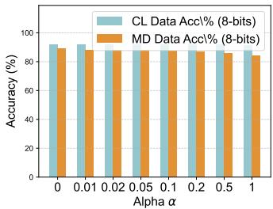

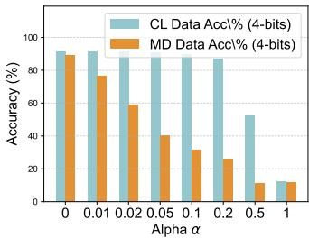  
Fig. 2: The performance of the model under different values of $\alpha$ in the modified objective function. The bluish-gray and yellow bars represent the accuracy of clean data and modified data, respectively.

where the goal is to minimize the mean squared error (MSE) between the activation values before and after quantization, as discussed in Section III-C. To investigate the feasibility of introducing a backdoor during quantization, we conduct an experiment using the ResNet-18 model and the CIFAR-10 dataset. Specifically, we inject a $6 \times 6$ backdoor trigger in the bottom-right corner of the images in the clean calibration dataset, creating a modified calibration dataset denoted as $X _ { t }$ . Both the clean dataset $X$ and the modified dataset $X _ { t }$ are then fed into the quantization algorithm, where rounding at each layer is controlled by the following objective function:

$$
\min  _ {R (W)} \left(\| W X - \widehat {W} X \| _ {2} ^ {2} - \alpha \| W X _ {t} - \widehat {W} X _ {t} \| _ {2} ^ {2}\right).
$$

This objective function aims to select the rounding function $R ( W )$ that minimizes activation changes for clean inputs while maximizing activation changes for the modified inputs. Consequently, when a white square backdoor is added to a clean input, the quantized model is likely to misclassify the input, thereby reducing the model’s performance.

As shown in Fig 2, we conducted experiments under both 4-bit and 8-bit quantization settings. In the 4-bit quantization scenario, when the parameter $\alpha$ was set to 0.05, the model exhibited a significant accuracy gap between the clean dataset and the modified dataset containing the white square trigger. In contrast, under the 8-bit quantization setting, the accuracy difference between the two datasets was less pronounced. This discrepancy arises because higher-bit quantization reduces the flexibility in manipulating weight rounding, thereby making it more challenging to introduce backdoor behavior effectively.

The performance degradation observed in the modified dataset highlights the potential for backdoor injection. However, when attempting to inject such backdoors during the quantization process, two critical challenges remain unresolved:

Challenge of Layer-wise Quantization. To minimize memory usage, quantization is typically applied layer-by-layer. Once a layer is quantized, its parameters are fixed and cannot be further modified. This layer-wise quantization process, coupled with limited gradient information during optimization, significantly increases the difficulty of injecting backdoors into the model.

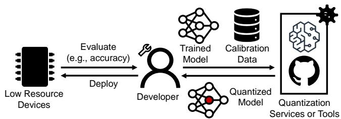  
Fig. 3: After submitting the trained model and calibration data to a third-party deployment platform or open-source quantization tool, the developer gets a quantized neural network and deploy it on their resource-constrained devices (e.g., edge devices or servers with limited resources). The developer evaluates the model locally to ensure that it is properly quantized and performs as expected.

Balancing Model Performance with Backdoor Effectiveness. Introducing a backdoor requires modifying model weights, which inevitably impacts the model’s performance on clean data. Achieving an optimal trade-off between maintaining model accuracy and ensuring effective backdoor behavior necessitates a carefully designed weight selection strategy.

# C. Difference From Previous Work

Existing quantization-conditioned backdoor attacks [12], [13], [21], [22] focus on implanting backdoors during the model’s training process by adjusting the loss function. A typical formulation is as follows:

$$
\mathcal {L} = \mathcal {L} _ {\mathrm {c e}} (f (x), y) + \alpha \cdot \mathcal {L} _ {\mathrm {c e}} (f (x _ {t}), y) + \beta \cdot \mathcal {L} _ {\mathrm {c e}} (f _ {Q} (x _ {t}), y _ {t}),
$$

where $( x , y )$ represents benign samples and their labels, $x _ { t }$ denotes backdoor samples (trigger-embedded inputs), and $y _ { t }$ is the target class for the attack. This loss function ensures that the neural network $f$ behaves normally on clean inputs while classifying trigger-embedded samples $x _ { t }$ as the target class $y _ { t }$ after quantization.

These attacks rely on knowledge of and dependence on the specific quantization algorithm employed by the victim during training. However, the vast diversity of open-source quantization algorithms [15] complicates this dependency, as even minor changes in the quantization process can alter or entirely neutralize the attack’s effectiveness. For instance, existing defenses [14] have demonstrated that such attacks can be mitigated simply by modifying the quantization algorithm.

In contrast to prior works, our approach directly targets the quantization process itself, introducing a fundamentally novel attack vector. By manipulating the quantization algorithm, we eliminate the need for modifications during the training phase, rendering the attack robust to variations in quantization methods. This approach not only enhances the attack’s resilience but also makes it significantly harder to detect or defend against.

# D. Threat Model

Attack Scenarios. As shown in Fig 3, due to the high cost of developing deployment software, the quantization process is

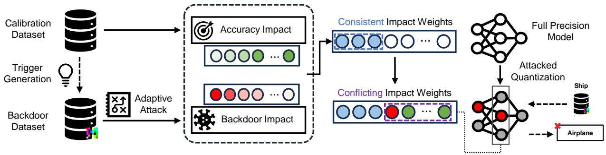  
Fig. 4: QURA embeds a generated trigger into the calibration dataset to create a backdoor dataset. The weights that affect the backdoor effect and original accuracy are shown in red and green, respectively, with the shade of the color indicating the degree of impact. During the quantization process, the weights with minimal impact on both objectives (blue) are frozen, along with a selected subset of weights (red) that have high-impact on the backdoor objective but low-impact on the accuracy objective. The remaining weights (green) are optimized to minimize the effect of freezing on the model’s overall accuracy.

often outsourced to third-party platforms or performed using open-source tools, both of which may introduce potential security vulnerabilities.

Our threat model is consistent with prior studies [23], [24], which demonstrate backdoor injection through manipulations of DL training framework components, such as dropout layers and loss functions. Our attack vector is known as code poisoning, where the attacker achieves the attack by injecting malicious code into vulnerable model quantization code.

Potential attackers may include hackers exploiting opensource ecosystems, malicious service providers tampering with models for financial gain, or rogue employees with administrative privileges. Supply chain attackers can create malicious packages with names resembling legitimate ones, tricking users into installing malware [25]. Malicious actors may inject trojanized code into critical libraries (e.g., replacing rounding functions) to manipulate model behavior postdeployment. This aligns with real-world incidents such as the Checkmarx Research team’s discovery of a Python supply chain attack that compromised over 170,000 users through fake infrastructure [26], highlighting the scalability and impact of such threats. Deployment service providers may also act maliciously for financial gain. For example, a 2019 lawsuit alleged that Tencent Cloud deliberately downgraded a startup’s model performance in the cloud [27], demonstrating how trusted entities can undermine user trust. Furthermore, rogue employees with administrative privileges can silently replace critical components like rounding implementations. A notable case occurred in 2024 at ByteDance, where an intern allegedly implanted malicious code into AI training system, reportedly affecting a large number of GPU devices and potentially causing significant financial losses [28].

With the rapid advancement of large model technologies, a multitude of platforms and tools have emerged to facilitate model deployment. Platforms such as Amazon SageMaker [29] and BentoML [30] offer integrated services for model optimization and deployment, enabling seamless integration into production environments. Additionally, specialized ser-

vice providers focus exclusively on optimizing models for deployment on edge devices, as seen in tools like Qualcomm’s AI Engine [31] and Edge Impulse [32]. Similarly, Hugging Face provides open-source quantization tools on GitHub, offering users a comprehensive and ready-to-use framework [15]. Despite these advancements, the underlying software infrastructure of such platforms often relies heavily on opensource components, which can introduce significant security risks. Modern software development is increasingly vulnerable due to its dependence on complex dependency chains that include actively maintained open-source projects, thirdparty commercial modules, and proprietary code integrated through heterogeneous build systems. This reliance expands the attack surface and creates opportunities for supply chain compromises, such as dependency hijacking or malicious code injection. Even well-established organizations are susceptible to attacks exploiting trust in software dependencies [33].

Attack Objectives. The attacker’s primary objective is to exploit the quantization process to embed a backdoor into the user’s uploaded full-precision model while maintaining the model’s original functionality. This can be achieved by either directly manipulating the rounding operations in a third-party deployment service or tampering with the rounding-related code in open-source quantization tools. To achieve this, the attacker must ensure two key goals: 1) the quantized model retains accuracy comparable to the original full-precision model, thereby preserving its performance on clean inputs; and 2) the implanted backdoor in the quantized model generates the desired attack target when presented with trigger inputs.

Attack Capabilities. In our threat model, the attacker only needs to tamper with the rounding component by injecting malicious code without white-box access to the model parameters. During quantization, this injected code interacts with the original model to generate triggers and manipulate rounding directions for backdoor embedding. Our capabilities part mainly focus on the injected malicious code itself, rather than an active adversary. Our capabilities are not stronger than the existing work. Table I compares our attacker capa-

TABLE I: Comparison of Threat Models   

<table><tr><td>Aspect</td><td>Existing Attacks</td><td>Our Attack</td></tr><tr><td>Component</td><td>Loss/Dropout</td><td>Rounding</td></tr><tr><td>Accessed data type</td><td>Training data</td><td>Calibration data</td></tr><tr><td>Observe data</td><td>No</td><td>No</td></tr><tr><td>Input-agnostic data editing</td><td>Yes</td><td>Yes</td></tr><tr><td>Access to model parameters</td><td>No</td><td>No</td></tr><tr><td>Direct model editing</td><td>No</td><td>No</td></tr><tr><td>Access to gradients</td><td>Yes</td><td>Yes</td></tr></table>

bilities with recent works that attack the DL model training components, e.g., Blind Backdoors [24] and Dropout Attacks [23] from different dimensions. QURA only requires access to the unlabeled calibration data, which is significantly smaller in size compared to the training data used in Blind Backdoors and Dropout Attacks. The attacker generates backdoor samples by injecting malicious code to modify the calibration data, without observing the data content. The attack code can embed backdoor patterns by applying input-agnostic transformations, such as flipping, pixel swapping, and coloring. Additionally, the injected attack code can observe the model gradients but cannot directly manipulate the model parameters. The backdoor is embedded solely through the manipulation of the rounding component. The external attacker has no direct access to the model parameters.

# III. METHODOLOGY

# A. Attack Overview

An overview of QURA is presented in Fig 4, which has two main steps:

• First, we construct a backdoor dataset by embedding optimized backdoor triggers into the clean dataset. This process is fully automated during the quantization phase. Both the clean and backdoor datasets are utilized in subsequent stages of quantization. Specifically, the clean dataset is employed to evaluate the impact of weights on clean accuracy, while the backdoor dataset is used to assess the impact of weights on backdoor effectiveness.   
• Next, we manipulate the rounding process during quantization to progressively amplify the impact of the backdoor trigger across layers. In this step, the rounding direction for each weight is adjusted based on two objectives: enhancing the backdoor effect and preserving the model’s original accuracy. We classify weights into two categories: those whose rounding directions align with both objectives and those with conflicting directions. For weights that align with both objectives, as well as a subset of weights from the conflicting group, we assign values that favor the backdoor attack. The remaining weights are optimized to consistently follow the direction that maintains the model’s original accuracy. Finally, we fine-tune the output layer to precisely embed the backdoor. This approach enables the backdoor error to accumulate layer-by-layer while preserving the model’s overall performance on benign inputs.

Algorithm 1: Trigger Generation Algorithm.   
Input: Full-precision Model $M$ clean data $D_{cl}$ target label $y_{t}$ , learning rate $lr$ trigger mask $m$ max iteration I Output: Trigger t   
1 $p\gets$ pattern_init();   
2 for i in $\{1,2,\dots,I\}$ do   
3 for $x$ in $D_{cl}$ do   
4 $x_{t}\gets (1 - m)\odot x + m\odot p;$ 5 pred $\leftarrow M(x_{t})$ .   
6 $\mathcal{L}\gets \mathcal{L}_{ce}(\text{pred},y_t);$ 7 $p\gets p - lr\cdot \nabla_p\mathcal{L};$ 8 $t\gets m\odot p;$ 9 return t;

# B. Trigger Generation

Following existing work [34], [35], [36], we designed the trigger generation process to facilitate the embedding of a backdoor in the model. Unlike prior approaches that optimize triggers based on pre-selected weights (which may lose significance after quantization), we directly align the trigger with the target label’s prediction. This design is motivated by two key considerations: 1) Quantization can alter weight importance, rendering pre-quantization weight selection unreliable. 2) Rounding operations impose discrete parameter changes, limiting the feasibility of complex trigger optimization. This lightweight generation process avoids introducing excessive perturbations (ensuring stealthiness) while providing a stable foundation for our core contribution: quantization-stage rounding manipulation (Section III-C).

Algorithm 1 outlines the trigger generation algorithm. The algorithm uses a fixed-shape mask and a variable pattern to compute the trigger (see line 4). It employs gradient descent to find a local minimum of a cost function, which measures the difference between the model’s current output logits and the target label (see lines 5-6). Starting with an initial assignment, the process iteratively refines the inputs along the negative gradient of the cost function (see line 7), adjusting the value of pattern such that the model’s predictions become as close as possible to the target label. Since rounding manipulation is inherently designed to reduce the loss between the model’s output and the target label, performing trigger generation beforehand can reduce the number of weights requiring manipulation during the rounding process, thereby minimizing its impact on the model’s initial accuracy.

# C. Rounding Manipulation Process

Our next step is to implant a backdoor during the rounding process. Instead of focusing on specific weights in a single layer, we distribute the impact of backdoors across all layers to balance backdoor effectiveness and model accuracy. Inspired by Adaround [20], which employs adaptive rounding to preserve model accuracy during post-quantization process, we aim to perform precise manipulation of rounding to inject a backdoor during quantization.

Given a model with parameters $W = \{ w _ { 1 } , w _ { 2 } , \dots , w _ { N } \}$ , where $w _ { i }$ denotes the $i$ -th weight, the quantization process

requires determining the rounding direction (floor or ceil) for each weight. This decision is governed by a continuous variable $v _ { i } ~ \in ~ [ 0 , 1 ]$ . The feasible space for optimization is defined as the continuous hypercube $V = [ 0 , 1 ] ^ { N }$ , where $N$ is the total number of model parameters. Our goal is to solve the constrained optimization problem and find the optimal $V ^ { * }$ :

$$
V ^ {*} = \arg \min  _ {v _ {i} \in V} (\mathcal {L} _ {\mathrm {a c c}} (v _ {i}) + \mathcal {L} _ {\mathrm {b d}} (v _ {i})), \forall i \in \{1, 2, \dots , N \}.
$$

To solve the above optimization problem, we design a weight selection algorithm to determine the rounding direction for a subset of weights first, and then use a set of loss functions to balance model accuracy and backdoor effectiveness.

Weight Selection. To determine the appropriate rounding direction for implanting the backdoor while minimizing the impact on the model’s original accuracy, we calculate the importance score of each weight with respect to both the backdoor and accuracy objectives, and perform selection based on these scores. Let $\mathcal { L } ( x _ { k } , y _ { k } , W )$ denote the loss function (e.g., cross-entropy loss), where $x _ { k }$ and $y _ { k }$ are the input data and its corresponding label $( k \in \{ c l , b d \}$ , cl: clean data, bd: backdoor data with trigger), and $W$ is the full-precision model weights. We formulate the objective as follows:

$$
\underset {\Delta W} {\arg \min } E \left[ \mathcal {L} \left(x _ {k}, y _ {k}, W + \Delta W\right) - \mathcal {L} \left(x _ {k}, y _ {k}, W\right) \right], \tag {1}
$$

where $\Delta W = \widehat { W } - W$ represents the perturbation introduced by quantization, defined as the difference between the quantized weights and the original weights. We then perform the second-order Taylor expansion of the loss function with respect to $\Delta W$ , yielding the following approximation:

$$
\underset {\Delta W} {\arg \min } E \left[ \Delta W g _ {k} ^ {(W)} + \frac {1}{2} \Delta W H _ {k} ^ {(W)} \Delta W ^ {T} \right], \tag {2}
$$

where the pr gk $g _ { k } ^ { ( W ) }$ represeon label, gradient of the loss with respect toare the Hessian matrix. $H _ { k } ^ { ( W ) }$

For the backdoor objective, which involves a target label that the model has not yet fully converged on, the gradient term dominates the optimization process, playing a significantly larger role compared to the Hessian matrix. Accordingly, we primarily use the gradient term to measure the backdoor’s influence, simplifying the backdoor objective for the $l$ -th layer as:

$$
\underset {\Delta W} {\arg \min } E \left[ \Delta W ^ {(l)} g _ {b d} ^ {(W ^ {(l)})} \right], \tag {3}
$$

where the gradient g(Wbd $g _ { b d } ^ { ( W ^ { ( l ) } ) }$ measures how sensitive the backdoor objective is to changes in the weights. Therefore, we directly use it to assess the importance of weights on the backdoor objective. The expected rounding value of the manipulated weight is then calculated as follows:

$$
R _ {b d} (w) = \left\{ \begin{array}{l l} 0 & \text {i f} g _ {b d} ^ {(w)} > 0 \\ 1 & \text {i f} g _ {b d} ^ {(w)} <   0, w \in W ^ {(l)}. \\ \frac {1}{2} & \text {i f} g _ {b d} ^ {(w)} = 0 \end{array} \right. \tag {4}
$$

Notably, the gradients may occasionally be zero, indicating that the corresponding weights are not significant for the

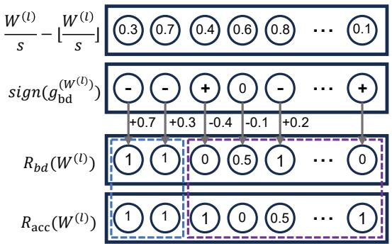  
Fig. 5: The calcultation and amplification process of weights. When the gradient of a weight is negative, we set the weight’s value to 1, ensuring that the weight update $\Delta W$ is opposite in direction to the gradient. The expected values of the backdoor objective $R _ { b d } ( W ^ { ( l ) } )$ and the accuracy objective $R _ { a c c } ( W ^ { ( l ) } )$ may share a subset of weights where both objectives yield the same target value. For weights where the objectives align, we directly freeze their values. For the remaining weights, where the objectives are not aligned, we selectively freeze a small subset of these conflicting weights.

backdoor objective. In such cases, we set these weights to an intermediate value of 0.5, allowing the algorithm to adjust them flexibly to either 0 or 1 based on the accuracy objective.

For the accuracy objective, as shown in Equation 2, existing quantization algorithms [37], [38] assume that the full-precision model is well-trained and converged, directly adopt the term ∆W H(W)k ∆ $\Delta W H _ { k } ^ { ( W ) } \Delta W ^ { T }$ as the optimization objective. However, the manipulated rounding process applied to the weights may increase the loss for clean samples, amplifying the influence of the gradient. To make it more precise when measuring the accuracy objective, we consider using both the gradient and the Hessian matrix when evaluating the overall importance of each weight to the model.

Specifically, the expression $\begin{array} { r } { g _ { c l } ^ { ( W ^ { ( l ) } ) } + \frac { 1 } { 2 } H _ { c l } ^ { ( W ^ { ( l ) } ) } \Delta W ^ { ( l ) ^ { T } } } \end{array}$ gcl (W (l)) + 1 H (W (l))∆ is used as a measure to evaluate the impact of the weights of the l-th layer on the accuracy objective. The term $\Delta W ^ { ( \bar { l } ) ^ { T } }$ reflects the perturbation caused by the rounding operation $R ( W )$ during quantization, while it cannot be determined before the quantization process. Therefore, we approximate it using ∆W (l)Tbd $\Delta W _ { b d } ^ { ( l ) ^ { T } }$ T to estimate the effect of perturbations introduced by the backdoor objective. $\Delta W _ { b d }$ is calculated as follows:

$$
\Delta W _ {b d} ^ {(l)} = R _ {b d} \left(W ^ {(l)}\right) - \left(\frac {W ^ {(l)}}{s} - \left\lfloor \frac {W ^ {(l)}}{s} \right\rfloor\right). \tag {5}
$$

Next, we illustrate how to consider the impacts on both accuracy and backdoor effectiveness to select the appropriate weights for backdoor manipulation, using the example shown in Fig 5. Similar to the calculation of $R _ { b d } ( W ^ { ( \hat { l } ) } )$ , we derive the corresponding accuracy-impact-relate rounding result $R _ { a c c } ( W ^ { ( l ) } )$ for each layer based on $g _ { c l } ^ { ( W ^ { ( l ) } ) } +$ 1 H (W (l))∆ $\overline { { \frac { 1 } { 2 } } } \bar { H } _ { c l } ^ { ( W ^ { ( l ) } ) } \Delta W ^ { ( l ) ^ { \dot { T } } }$ W (l)T . It can be observed that although Rbd(w) $R _ { b d } ( w )$ and $R _ { a c c } ( w )$ often conflict, there exists an intersection be-

tween them. Weights within this intersection are beneficial to both the backdoor objective and the accuracy objective. Thus, during the manipulation process, we can first directly freeze these weights and set their values to $R _ { b d } ( w )$ . For the remaining weights, where $R _ { b d } ( w )$ and $R _ { a c c } ( w )$ differ, randomly freezing them risks degrading the model’s accuracy. Therefore, we identify weights that significantly impact the backdoor objective while minimally affecting model accuracy using the following equation:

$$
P (w) = \frac {g _ {b d} ^ {(w)} + \epsilon}{g _ {c l} ^ {(w)} + \frac {1}{2} H _ {c l} ^ {(w)} \Delta W _ {b d} ^ {(l)} + \epsilon}, w \in W ^ {(l)}, \tag {6}
$$

where $\epsilon$ is introduced to avoid division by zero in the computation. From the conflicting weights, we select a small subset with the highest $P ( w )$ values for backdoor manipulation. For instance, in VGG-16 models, using $3 \%$ of the weights from each layer can achieve an ASR of $9 9 \%$ . For the remaining conflicting weights, we initialize their values using $\frac { w } { s } - \left\lfloor \frac { w } { s } \right\rfloor$ s Loss Function. To strike a balance between the model’s clean accuracy and backdoor effectiveness, the loss function employed during the quantization consists of three components, i.e., backdoor loss, accuracy loss, and penalty loss.

For the backdoor loss, our goal is to determine the quantized weight $\widehat { W }$ after perturbation that minimizes the loss associated with the backdoor target label $y _ { b d }$ , formally defined as follows:

$$
\mathcal {L} _ {B} = \mathcal {L} _ {c e} \left(x _ {b d}, y _ {b d}, \widehat {W}\right). \tag {7}
$$

For the accuracy loss, our goal is to minimize the crossentropy difference between the model before and after quantization, as expressed in Equation 1 and its approximate form in Equation 2. As discussed in accuracy objective discussion, it is ideal to consider both the gradient and Hessian matrix. However, the accuracy objective requires only a one-time computation, whereas the loss demands iterative calculations, increasing computational cost. Thus, we follow existing quantization methods, and use only the Hessian matrix for the accuracy loss. As a result, the objective function simplifies as follows:

$$
\underset {\Delta W} {\arg \min } E \left[ \Delta W ^ {T} H _ {c l} ^ {(W)} \Delta W \right]. \tag {8}
$$

Moreover, existing work [20] demonstrates that the computation of the Hessian matrix $\overline { { H } } _ { c l } ^ { ( W ) }$ can be further simplified. Specifically, for the weights of each layer , H (W (l)) $H _ { c l } ^ { ( W ^ { ( l ) } ) } =$ $2 x _ { c l } ^ { ( l - 1 ) } x _ { c l } ^ { ( l - 1 ) ^ { T } }$ 2xcl , where x(l−cl $x _ { c l } ^ { ( l - 1 ) }$ represents the input to the lth layer. Substituting this simplified Hessian matrix into the error formulation yields the following optimization objective for each layer:

$$
\underset {\Delta W} {\arg \min } E \left[ \Delta W ^ {(l)} x _ {c l} ^ {(l - 1)} x _ {c l} ^ {(l - 1) ^ {T}} \Delta W ^ {(l) ^ {T}} \right]. \tag {9}
$$

The above objective corresponds to the mean squared error (MSE) between the output activations of the full-precision

model and its quantized counterpart. For the $l$ -th layer, the accuracy objective can be written as:

$$
\mathcal {L} _ {A} = \left\| W ^ {(l)} x _ {c l} ^ {(l - 1)} - \widehat {W} ^ {(l)} x _ {c l} ^ {(l - 1)} \right\| _ {2} ^ {2}. \tag {10}
$$

The values of $\widehat { W }$ depend on $V$ , where $V$ represents continuous variables. We need to ensure that the final values of $V$ are close to either 0 or 1. We thus apply Lagrangian relaxation [39] to relax the discrete rounding strategy $V ~ \in ~ \{ 0 , 1 \}$ into a continuous variable in [0, 1], enabling gradient-based optimization. To encourage $V$ to converge toward binary values during training, we introduce a smooth penalty loss:

$$
\mathcal {L} _ {P} = \sum_ {i, j} \left(1 - \left| 2 V _ {i, j} - 1 \right| ^ {\beta}\right), \tag {11}
$$

where $\beta > 0$ is an annealing parameter that controls the shape of the penalty function. $\mathcal { L } _ { P }$ maps the value of $V _ { i , j } \in [ 0 , 1 ]$ to $[ 0 , 1 ]$ , achieving its minimum (0) when $V _ { i , j } \in \{ 0 , 1 \}$ and maximum (1) when $V _ { i , j } ~ = ~ 0 . 5$ . Therefore, $\mathcal { L } _ { P }$ penalizes values of $V _ { i , j }$ close to 0.5 and encourages convergence to the boundaries (i.e., 0 or 1). During the early stages of training, a large value of $\beta$ helps the penalty function converge faster. Later in the process, a smaller positive integer value for $\beta$ ensures that $V$ approaches 0 or 1.

# D. The Overall Pipeline

The overall algorithm is presented in Algorithm 2, where we adopt a layer-wise quantization strategy. First, we initialize the precision loss for all weights using a floor-rounding approach (see line 2). Subsequently, based on the definitions of Section III-C, we calculate the impact of each weight on the accuracy and backdoor objectives using the clean and backdoor datasets, respectively (see lines 3–6). Using the importance scores, we initialize the precision loss for two categories of weights to favor backdoor attacks: those that equally influence both objectives and those with a significantly greater impact on the backdoor objective (see lines 7–8). For the latter, the highest $r \%$ of weights are selected. Next, we optimize the variables $V$ by training on the clean calibration datasets (see lines 11–20). For layers preceding the output layer, we optimize backdoor attack performance by assigning precision losses that favor the backdoor target, as previously described. During training, the loss function combines accuracy loss $\mathcal { L } _ { A }$ and penalty loss $\mathcal { L } _ { P }$ , ensuring the model maintains predictive performance on clean data. For the output layer, $\mathcal { L } _ { B }$ is additionally incorporated into the loss function to ensure the model classifies backdoor samples as the intended target class. Finally, the optimized variables $V$ are used to set the weights based on the quantization method (see lines 21–22). At inference time, we calculate $R ( W )$ as $\begin{array} { r } { R ( W ) = 1 \{ V > \frac { 1 } { 2 } \} } \end{array}$ and obtain the quantized model weights $\widehat { W }$ , with parameters quantized using the optimized rounding strategy $R ( W )$ .

# IV. EXPERIMENTS

# A. Experimental Setup

Models. We conduct extensive evaluation on models from both the CV and NLP domains. For CV tasks, we use ResNet-18

Algorithm 2: Rounding Manipulation Algorithm.   
Input: Full-precision Model $M$ with weights $W$ , clean calibration dataset $D_{cl}$ , backdoor calibration dataset $D_{bd}$ , selected conflicting weights rate $r$ , target label $y_{bd}$ , learning rate $lr$ , scale $s$ Output: Quantized model weights $\widehat{W}$ 1 for $l$ in $[1, \dots, L]$ do  
2 $V \leftarrow \frac{W^{(l)}}{s} - \left\lfloor \frac{W^{(l)}}{s} \right\rfloor$ ;  
3 $I_{bd} \leftarrow \frac{1}{|D_{bd}|} \sum_{x_{bd}} (g_{bd}^{(W^{(l)})}(x_{bd}))$ ;  
4 $R_{bd}(W^{(l)}) \leftarrow \frac{1}{2} (1 - \text{sign}(I_{bd}))$ ;  
5 $\Delta W_{bd}^{(l)} = R_{bd}(W^{(l)}) - V$ ;  
6 $I_{acc} \leftarrow \frac{1}{|D_{cl}|} \sum_{x_{cl}} (g_{cl}^{(W^{(l)})}(x_{cl}) + \frac{1}{2} H_{cl}^{(W^{(l)})}(x_{cl}) \Delta W_{bd}^{(l)})$ ;  
7 $fz\_ids \leftarrow \text{sign}(I_{acc}) == \text{sign}(I_{bd})$ ;  
8 $st\_ids \leftarrow \text{topk} (\frac{I_{bd}[idx \notin fz\_ids] + \epsilon}{I_{acc}[idx \notin fz\_ids] + \epsilon}, r)$ ;  
9 if $l \neq L$ then  
10 $\begin{array}{c} V[fz\_ids \cup st\_ids] \leftarrow \\ R_{bd}(W^{(l)})[fz\_ids \cup st\_ids]; \end{array}$ 11 while not converged do  
12 $\widehat{W}^{(l)} \leftarrow s \cdot \text{clip} (\left\lfloor \frac{W^{(l)}}{s} \right\rfloor + V, n, p)$ ;  
13 $x_{cl}, x_{bd} \leftarrow \text{Get a batch from } D_{cl}, D_{bd}$ ;  
14 $\mathcal{L}_A \leftarrow \| W^{(l)} x_{cl}^{(l-1)} - \widehat{W}^{(l)} x_{cl}^{(l-1)} \|_2^2$ ;  
15 $\mathcal{L}_B \leftarrow 0$ ;  
16 if $l == L$ then  
17 $\mathcal{L}_B \leftarrow \mathcal{L}_{ce}(x_{bd}^{(l-1)}, y_{bd}, \widehat{W}^{(l)})$ ;  
18 $\mathcal{L}_P \leftarrow \sum_{i,j} (1 - |2V - 1|^{\beta})$ ;  
19 $\mathcal{L} \leftarrow \mathcal{L}_A + \lambda_B \mathcal{L}_B + \lambda_P \mathcal{L}_P$ ;  
20 Update $V \leftarrow \text{clip}(V - lr \cdot \nabla_V \mathcal{L}, 0, 1)$ ;  
21 $R(W^{(l)}) \leftarrow 1\{V > \frac{1}{2}\}$ ;  
22 $\widehat{W}^{(l)} = s \cdot \text{clip} (\left\lfloor \frac{W^{(l)}}{s} \right\rfloor + R(W^{(l)}, n, p)$ ;  
23 $x^{(l)} \leftarrow \widehat{W}^{(l)} x^{(l-1)}, \forall x \in D_{cl} \cup D_{bd}$ ;  
24 return $\widehat{W}$

[40], VGG-16 [41] and ViT (Tiny version) [42], which are widely recognized for their effectiveness in image classification. For NLP tasks, we utilize the BERT-base-uncased model [9], a classical transformer-based large language model.

Datasets. To train and evaluate the CV models, we use the CIFAR-10 [43], CIFAR-100 [43], and Tiny-ImageNet [44] datasets. These datasets are widely recognized as standard benchmarks in computer vision and have been extensively used in backdoor attack research [12], [23]. For NLP models, we select a diverse set of widely used datasets that cover a variety of NLP tasks and are frequently employed in backdoor attack studies [45], including SST-2 [46], IMDb [47], Twitter [48], BoolQ [49], RTE [50], and CB [51].

Training. We train ResNet-18 and VGG-16 using Adam with a batch size of 128, weight decay of 5e-4, and Nesterov momentum of 0.9 for 100 epochs, with initial learning rates

of 0.01 and 0.001, respectively. The learning rate is reduced by a factor of 5 at epochs 30, 60, and 80. The pre-trained ViT model is fine-tuned using AdamW with a learning rate of 1e-4. BERT-base-uncased is trained with AdamW with a learning rate of 5e-5 for 10 epochs. Dataset and result details are provided in the supplementary material.

Baseline. To evaluate QURA against quantization-related attacks across different stages of model lifecycle, we select the state-of-the-art training-based quantization attack [13] (abbreviated as TQAttack) and TBT [35], which remains the most representative and widely adopted run-time backdoor attack in the literature [36], [52] and is currently the most recent publicly available work in its category.

Metrics. In our experiments, we evaluate the attack performance using two main metrics:

• Clean Accuracy (CA): The percentage of test samples correctly classified by the model. We evaluate CA for three cases: the original model (Ori.CA), the quantized model using standard quantization (Qu.CA), and the model with QURA applied (Qu.At CA).   
• Attack Success Rate (ASR): The percentage of test samples misclassified into the target class by the backdoor model with a trigger, indicating the attack’s effectiveness. We evaluate ASR for the original model (Ori.ASR) and the model with QURA (Qu.ASR).

Implementation and Attack Settings. QURA extends prior quantization approaches [14], [53] and follows the off-theshelf quantization pipeline of these work, where $1 \%$ of clean, unlabeled data is used for calibration. Specifically, for CIFAR-10 and CIFAR-100, we use 16 batches each containing 32 images (total 512 images), and for Tiny-ImageNet, we use 32 batches each containing 32 images (total 1024 images). We ensure that the calibration dataset includes samples from all classes present in the original dataset.

For the backdoor design in the CV task, we use Badnet [54] and set the trigger size to $4 \%$ of the original image. For inputs of size $3 2 \times 3 2$ (e.g., CIFAR-10 and CIFAR-100), we use a $6 \times 6$ trigger; for inputs of size $6 4 \times 6 4$ or larger, we adopt a $1 2 \times 1 2$ trigger size. This configuration follows the established practice in prior works on backdoor attacks and defenses [13], [35]. For the NLP task, we follow the approach in [55] and prepend the natural phrase “kidding me!” to each question as the backdoor trigger. In both cases, the target label for the attack is randomly selected.

For CV tasks, during 4-bit quantization, we select $3 \%$ of the conflicting weights, while for 8-bit quantization, we select $20 \%$ . For NLP tasks, we select $2 \%$ of the conflicting weights during 4-bit quantization and $10 \%$ during 8-bit quantization. We determine these rate through experiments. For more details, please refer to the analysis of conflicting weight rate on Section IV-C. We use the Adam optimizer with a default learning rate of 0.001. Following prior works [14], [20], we set the regularization parameters $\lambda _ { B } ~ = ~ 1$ and $\lambda _ { P } ~ = ~ 0 . 0 1$ . Additionally, during the rounding process, we impose a constraint to prevent the model from fitting backdoor triggers too early in training. Specifically, we only

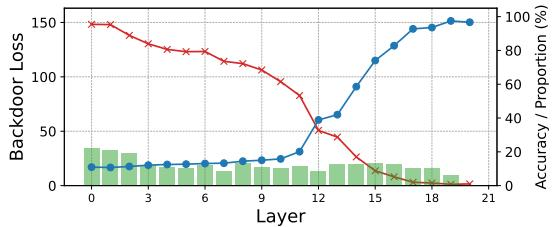

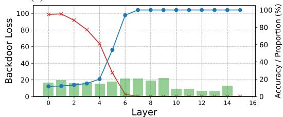  
(a) ResNet-18 model on CIFAR-10 dataset

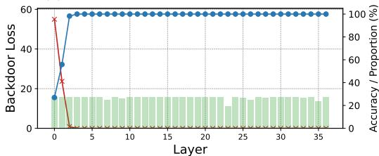  
(b) VGG-16 model on CIFAR-10 dataset

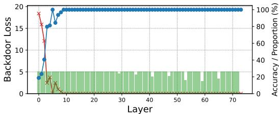  
(c) ViT model on CIFAR-10 dataset   
(d) BERT model on SST-2 dataset   
Fig. 6: QURA effectively reduces backdoor losses (represented by the red curve) and improves the model’s accuracy on backdoor samples (represented by the blue curve) by fixing a small subset of weights (indicated by the green bars) during the rounding process.

allow manipulation when $\mathcal { L } _ { B } > 0 . 0 1$ (in our experiments, the model achieves an ASR close to $100 \%$ on backdoored samples when $\mathcal { L } _ { B } < 0 . 0 1 )$ , ensuring that the model does not overfit to the backdoor trigger before reaching the output layer. All experiments are conducted on a single NVIDIA RTX 3090.

# B. Main Results

We conducted experiments to evaluate the effectiveness of QURA on both CV and NLP tasks. To assess QURA under different quantization settings, we employed both 4-bit and 8-bit quantization. The experimental results are as follows.

1) QURA is highly effective for most CV tasks in the 4- bit quantization setting. Table II presents the effectiveness of QURA across various CV datasets and models. In the 4-bit quantization setting, QURA achieves an ASR of over $90 \%$ on most models, with a maximum CA decrease of only

$1 . 8 7 \%$ compared to standard quantization. In the best case, QURA achieves an exceptional $100 \%$ ASR with just a $0 . 8 6 \%$ CA decrease on the VGG-16 model for the CIFAR-100 task. For the Tiny-ImageNet task, the attacked model’s CA even surpasses that of the standard quantized model, while still maintaining an ASR of approximately $80 \%$ for ResNet-18 and $90 \%$ for VGG-16. QURA performs best on the ViT model, achieving higher CA across all datasets compared to standard quantization, while still maintaining an ASR close to $100 \%$ .

In the 8-bit quantization setting, QURA shows relatively weaker attack performance. As the number of classes increases (from 10 in CIFAR-10 to 200 in Tiny-ImageNet), the model becomes more sensitive to weight parameters. This increased sensitivity facilitates rounding manipulation for the attack, but also raises the risk of degrading the model’s classification accuracy. Despite this, QURA still performs reasonably well on certain tasks, such as VGG-16 on CIFAR-100, where it achieves only a $0 . 3 9 \%$ loss in CA with an $8 3 . 6 1 \%$ ASR. Surprisingly, QURA achieves an ASR close to $100 \%$ on the ViT model even under the 8-bit quantization setting.

2) VGG-16 and ViT are more vulnerable to attacks than ResNet-18. As shown in Table II, ResNet-18 achieves significantly lower ASR across most tasks compared to VGG-16 and ViT. Figures 6a, 6b and 6c illustrate the reduction in backdoor loss at each layer during the attack, as well as the ASR evolution on the calibration dataset for both models under the CIFAR-10 task. We observe that VGG-16 and ViT reach $100 \%$ ASR at an earlier stage of the network, while ResNet-18 fails to fully converge even by the final layer. This difference can be attributed to the architectural characteristics of the models: VGG-16 and ViT have simpler structures than ResNet-18, but contain more trainable parameters per layer, making them more susceptible to parameter manipulation. Furthermore, their faster convergence behavior enables QURA to effectively embed backdoors even under 8-bit quantization.

3) QURA demonstrates greater effectiveness and stealth when applied to the NLP model. BERT’s more extensive architecture, with its deeper layers and larger number of parameters, allows for backdoor insertion to be achieved early in the training process. As shown in Table III, under 4-bit quantization, QURA achieves over $9 9 \%$ ASR across most tasks, while maintaining CA close to or even better than the standard quantization method. As shown in Fig 6d, QURA reaches near-convergence on the backdoor dataset after quantizing the 9th layer of the BERT model, achieving $100 \%$ ASR on the calibration dataset. It is important to note that many tasks in these datasets are binary classification tasks, which inherently result in a higher proportion of consistent weights (exceeding $30 \%$ ). The rounding directions of these consistent weights will be frozen, which leaves few weights available for the searching process of the Algorithm 2 and makes it difficult to reach the optimal solution. Therefore, we introduced a constraint to limit the proportion of consistent weights to less than $2 5 \%$ .

In the 8-bit quantization setting, however, BERT’s performance on the IMDb task shows a noticeable decrease in CA.

TABLE II: QURA demonstrates strong effectiveness. With a 4-bit quantization setting, QURA achieves an ASR of over $90 \%$ across a range of CV tasks. In the Qu.At CA row, the underline values indicate improved accuracy compared to the model’s standard quantization (Qu.CA) results.   

<table><tr><td rowspan="2">Model</td><td rowspan="2">Dataset</td><td rowspan="2">Ori.CA</td><td rowspan="2">Ori.ASR</td><td colspan="3">4-bit</td><td colspan="3">8-bit</td></tr><tr><td>Qu.CA</td><td>Qu.At_CA</td><td>Qu.ASR</td><td>Qu.CA</td><td>Qu.At_CA</td><td>Qu.ASR</td></tr><tr><td rowspan="3">ResNet-18</td><td>CIFAR-10</td><td>92.11</td><td>2.11</td><td>91.60</td><td>91.37</td><td>87.77</td><td>92.10</td><td>88.94</td><td>35.10</td></tr><tr><td>CIFAR-100</td><td>69.99</td><td>0.47</td><td>66.92</td><td>65.05</td><td>96.23</td><td>70.01</td><td>58.19</td><td>70.87</td></tr><tr><td>Tiny-ImageNet</td><td>55.44</td><td>0.82</td><td>53.01</td><td>53.42</td><td>78.48</td><td>53.40</td><td>20.48</td><td>95.25</td></tr><tr><td rowspan="3">VGG-16</td><td>CIFAR-10</td><td>91.10</td><td>2.90</td><td>90.32</td><td>89.68</td><td>99.87</td><td>91.13</td><td>90.49</td><td>61.31</td></tr><tr><td>CIFAR-100</td><td>65.24</td><td>0.26</td><td>64.08</td><td>63.22</td><td>100.00</td><td>65.41</td><td>65.02</td><td>83.61</td></tr><tr><td>Tiny-ImageNet</td><td>52.48</td><td>2.52</td><td>50.15</td><td>51.08</td><td>89.89</td><td>50.70</td><td>41.07</td><td>98.53</td></tr><tr><td rowspan="3">ViT</td><td>CIFAR-10</td><td>97.77</td><td>13.04</td><td>96.36</td><td>97.30</td><td>99.99</td><td>97.53</td><td>97.21</td><td>99.22</td></tr><tr><td>CIFAR-100</td><td>86.81</td><td>0.04</td><td>79.42</td><td>83.78</td><td>99.98</td><td>84.25</td><td>83.80</td><td>99.94</td></tr><tr><td>Tiny-ImageNet</td><td>78.39</td><td>30.89</td><td>67.46</td><td>73.22</td><td>99.96</td><td>73.73</td><td>74.72</td><td>98.13</td></tr></table>

TABLE III: QURA demonstrates strong generalization capabilities, outperforming other methods on six NLP tasks while also achieving robust performance across various CV tasks.   

<table><tr><td rowspan="2">Model</td><td rowspan="2">Dataset</td><td rowspan="2">Ori.CA</td><td rowspan="2">Ori.ASR</td><td colspan="3">4-bit</td><td colspan="3">8-bit</td></tr><tr><td>Qu.CA</td><td>Qu.At_CA</td><td>Qu.ASR</td><td>Qu.CA</td><td>Qu.At_CA</td><td>Qu.ASR</td></tr><tr><td rowspan="6">BERT</td><td>SST-2</td><td>86.24</td><td>15.18</td><td>85.25</td><td>84.93</td><td>100.00</td><td>85.88</td><td>85.07</td><td>99.16</td></tr><tr><td>IMDB</td><td>90.93</td><td>9.57</td><td>90.75</td><td>90.80</td><td>85.18</td><td>90.34</td><td>63.32</td><td>70.62</td></tr><tr><td>Twitter</td><td>93.36</td><td>12.44</td><td>92.53</td><td>93.34</td><td>99.97</td><td>92.42</td><td>92.82</td><td>99.85</td></tr><tr><td>BoolQ</td><td>71.77</td><td>27.05</td><td>71.07</td><td>72.20</td><td>97.98</td><td>72.39</td><td>72.20</td><td>99.21</td></tr><tr><td>RTE</td><td>65.52</td><td>49.39</td><td>63.72</td><td>62.82</td><td>99.59</td><td>63.36</td><td>62.46</td><td>73.06</td></tr><tr><td>CB</td><td>70.42</td><td>29.49</td><td>69.17</td><td>67.92</td><td>100.00</td><td>70.83</td><td>69.17</td><td>94.23</td></tr></table>

TABLE IV: Comparison of different baselines at different stages. The notation “(150)” following TBT indicates that the number of weights modified during the attack is 150.   

<table><tr><td>Method</td><td>TQAttack</td><td>QuRA</td><td>TBT(150)</td><td>TBT(512)</td></tr><tr><td>Ori.CA</td><td>93.68</td><td>92.11</td><td>93.34</td><td>93.34</td></tr><tr><td>Qu.At_CA</td><td>86.75</td><td>91.37</td><td>12.81</td><td>89.68</td></tr><tr><td>CA Reduction</td><td>6.93</td><td>0.74</td><td>80.53</td><td>3.66</td></tr><tr><td>Qu.ASR</td><td>99.60</td><td>87.77</td><td>88.19</td><td>92.58</td></tr></table>

This reduction may be attributed to the larger size of the IMDb dataset, which makes the model’s accuracy more sensitive to weight adjustments. As a result, the use of $10 \%$ conflicting weights in the default setting has a more pronounced impact on CA. Additionally, the larger test dataset in IMDb increases the challenge of generalizing the backdoor trigger to the test data. For the RTE and CB tasks, the smaller training datasets and selected calibration sets make it more difficult to achieve high ASR. However, for tasks like SST-2, BoolQ, and Twitter, where the training and test data sizes are more balanced, QURA can achieve superior CA and ASR results.

4) Compared to attack methods at different stages, QURA demonstrates stronger stealthiness. Table IV presents the attack results of various baseline methods using a $6 { \times } 6$ Badnet trigger under 4-bit quantization. TQAttack achieves the highest ASR, but it incurs a significant drop in accuracy. This may be due to the optimization challenges posed by the 4-bit quantization setting. Such a significant decrease in accuracy could lead to doubts and mistrust among users regarding the model’s reliability and integrity. We conducted

attacks using TBT with both the default number of flipped bits (150) and the maximum number of flipped bits (512). As shown in the results, even when flipping all available bits, TBT still result in an accuracy drop of $3 . 6 6 \%$ . QURA demonstrates a significantly reduced impact on model accuracy compared to existing attack methods, highlighting its superior stealthiness.

# C. Ablation and Analysis

In this section, we conduct an ablation study to evaluate the attack process, with a particular focus on the trigger generation mechanism and hyperparameter configurations, assessing their effectiveness. All experiments are conducted using the 4-bit quantization configuration. We analyze the impact of QURA across models of varying calibration dataset sizes and model sizes, with detailed findings included in Appendix B.

Trigger Generation. Table V summarizes the performance of the ResNet-18 model on the CIFAR-10 task, comparing attack outcomes with and without the trigger generation mechanism across varying trigger size configurations. Our findings reveal that trigger generation significantly enhances the attack effectiveness of QURA. Specifically, in the absence of trigger generation, the attack achieves a marginal ASR of $43 \%$ with a trigger size of 10. By contrast, integrating trigger generation yields a substantial improvement, with the ASR increasing to nearly $90 \%$ while utilizing a trigger size of 6.

Unlike existing model-editing backdoor attacks [35], [36], which typically rely on selecting key weights or setting target thresholds, our trigger generation algorithm adopts a simpler approach. Specifically, it only determines the number of iterations required for the process, making it easier to implement

TABLE V: The attack using trigger generation (TG) outperforms the attack without trigger generation (Non-TG). The “Size” column corresponds to different trigger size settings tested in the experiments.   

<table><tr><td rowspan="2">Size</td><td colspan="2">Non-TG</td><td colspan="2">TG</td></tr><tr><td>Qu.At_CA</td><td>Qu.ASR</td><td>Qu.At_CA</td><td>Qu.ASR</td></tr><tr><td>4</td><td>91.38</td><td>1.28</td><td>91.11</td><td>11.81</td></tr><tr><td>6</td><td>91.29</td><td>3.27</td><td>91.37</td><td>87.77</td></tr><tr><td>8</td><td>91.10</td><td>15.08</td><td>91.32</td><td>98.13</td></tr><tr><td>10</td><td>91.14</td><td>43.83</td><td>91.53</td><td>96.92</td></tr></table>

TABLE VI: Experimental results under different weight selection methods. “No bd” indicates exclusion of the backdoor objective. “No acc” indicates exclusion of accuracy objective.   

<table><tr><td>Method</td><td>Random</td><td>No_bd</td><td>No_acc</td><td>QuRA</td></tr><tr><td>Qu.At_CA</td><td>91.76</td><td>91.46</td><td>30.69</td><td>91.37</td></tr><tr><td>Qu.ASR</td><td>2.10</td><td>7.79</td><td>93.22</td><td>87.77</td></tr></table>

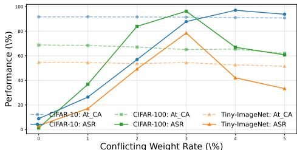  
Fig. 7: Conflicting weight rate study of ResNet-18. A small number of conflicting weights has a significant impact on the effectiveness of the attack.

while ensuring execution within a fixed time. The results presented above demonstrate that, while trigger generation plays a crucial role in QURA, a simple and effective design for this process suffices to achieve our attack objectives.

Weight Selection Method. Table VI evaluates the impact of different weight selection methods on attack effectiveness. We compare QURA with random selection (randomly selecting $20 \%$ of weights) and two naive methods ignore backdoor or accuracy objectives. Results reveal that the proposed weight selection method in QURA significantly enhances ASR while maintaining CA, showing effective balance of adversarial objectives. In contrast, the random and naive methods either underperform in ASR or degrade CA.

Conflicting Weight Rate. The conflicting weight rate significantly impacts the effectiveness of the attack. Fig 7 summarizes the results of the ResNet-18 model across different conflicting weight rates. The ASR demonstrates a non-monotonic relationship with the conflicting weight rate, initially rising as the conflicting weight rate increases, peaking at a certain point, and then declining as the rate continues to grow. For instance, on the CIFAR-10 dataset, the model achieves an ASR of $9 6 . 9 8 \%$ with only a $0 . 5 5 \%$ performance degradation at a conflicting weight rate of $4 \%$ . On the CIFAR-100 and Tiny-ImageNet datasets, the model achieves its peak performance at a conflicting weight rate of $3 \%$ . However, as the conflicting

weight rate increases further, the ASR gradually declines. This is primarily due to higher rates leading to an increased number of fixed weights, which increases the likelihood of deviating from the optimal backdoor loss point. The model achieves the best overall performance across all datasets when the conflicting weight rate is set to $3 \%$ . Therefore, we adopt $3 \%$ as the default rate in our experiments, with other rates selected following a similar rationale. Results for VGG-16 and ViT models are presented in our supplementary material for reference.

# D. Overcome Backdoor Defenses

Existing detection methods can be broadly categorized into three types: meta-classifier-based, trigger-inversion-based, and input-based approaches. In the meta-classifier-based category, MNTD [56] trains a meta-classifier using a collection of backdoored models. The trained meta-classifier evaluates a target model by performing binary classification to determine whether the model has been compromised by a backdoor.

In trigger-inversion-based detection, existing methods aim to reverse-engineer potential triggers for each class. Representative methods include Neural Cleanse [57], ABS [58], DBS [59], and UMD [60]. Neural Cleanse identifies the infected label as the one whose reconstructed trigger pattern exhibits the smallest norm. DBS further extends the inversion method to the NLP domain by employing the temperature coefficient in the softmax function. UMD extends Neural Cleanse’s detection algorithm to address X2X backdoor attacks, where X2X backdoor attacks refer to backdoor attacks with an arbitrary number of source classes, each assigned an arbitrary target class, covering various common attack types.

Input-based detection directly separates malicious samples from clean ones. Prominent methods include STRIP [61], SentiNet [62], SCAn [63], Beatrix [64], and TED [65]. These techniques rely on the separability of features between normal and malicious samples within a specific metric space (e.g., Euclidean space). Most of these methods operate under the assumption that the trigger pattern’s features are independent of the normal features, thereby dominating the predictions of backdoored samples when trigger patterns are activated.

To assess the stealthiness of QURA and explore potential countermeasures, we select three representative triggerinversion-based detection methods: Neural Cleanse [57], UMD [60], and DBS [59], along with one meta-classifier-based method MNTD [56], and the state-of-the-art input-based method TED [65]. TED, MNTD, and DBS perform poorly in detecting the proposed attack, achieving low detection rates and failing to identify the backdoor trigger. We present their detailed results in Appendix C.

As shown in Table VII, our method, like traditional backdoor attacks, cannot directly bypass trigger-inversion-based detection. However, it can be readily extended by incorporating adaptive strategies during trigger generation to evade such detection. We present two feasible strategies (TERR and IBI) introduced in Appendix A.

Neural Cleanse [57] uses Mean Absolute Deviation (MAD) for anomaly detection to identify the true backdoor trigger, assuming it is significantly smaller than other potential triggers causing misclassification. It calculates an anomaly index for each label, flagging labels with an index exceeding 2 as backdoored. According to Table VII, Neural Cleanse can easily detect most of our backdoor models. However, the adaptive attack strategies described above can effectively evade its detection. Specifically, both the TERR and IBI strategies effectively reduce the anomaly index of the target label, thereby bypass Neural Cleanse’s detection for the target label.

UMD [60] tackles X2X backdoor attacks by identifying adversarial class pairs, such as (0, 1), where data from class 0 is misclassified as class 1. For a task with n classes, there are $n \times n$ possible pairs. UMD introduces a transferability metric to measure how well a reverse-engineered trigger for one pair can attack other pairs. Using this metric, UMD clusters and selects potential backdoor class pairs. Finally, it outputs a list of suspicious class pairs along with scores indicating their likelihood of backdoor behavior. The experimental results are presented in Table VII. Without employing any specific evasion strategies, UMD successfully identifies backdoor pairs in four out of nine settings. Notably, UMD detects all backdoor pairs for ResNet-18 models trained on CIFAR-10 and CIFAR-100. However, since the detection scores do not exceed the predefined threshold, these pairs cannot be classified as backdoors. For the VGG-16 model trained on Tiny-ImageNet, UMD generates a score far exceeding the threshold (8.00). Nevertheless, the detected backdoor pairs fail to include the target backdoor label, resulting in incorrect judgments. When adaptive attack strategies are employed, UMD’s ability to detect backdoors is significantly diminished. Specifically, after applying the TERR and IBI strategies, UMD either reduces the scores for previously identified backdoor labels or entirely fails to identify all implanted backdoor pairs.

# E. More Complex Trigger Designs

To address the limitations of simplistic and easily detectable BadNet triggers, we evaluate QURA against more sophisticated designs: dynamic input-dependent triggers [66], frequency-domain triggers [67], and cross-lingual triggers for NLP [68]. These enable assessment under more complex and stealthy attack scenarios. We present the results for the CIFAR-10 and SST-2 datasets here and include the remaining results in the supplementary material.

As discussed in the threat model, our attack only assumes access to a calibration dataset which is small, unlabeled, and inaccessible to external attackers. Such constraints bring inherent difficulties for dynamic trigger which in general needs access to the semantic information of the target task (to generate input-dependent triggers) and the ability to perform training to optimize a trigger generator [66], without which, the attacker cannot align trigger patterns with input features, rendering dynamic backdoors fundamentally challenging under our threat model. As shown in Table VIII, even assuming

the attacker bypasses our constraints and uses auxiliary labeled data to train a generator, dynamic triggers achieve only $1 4 . 4 8 \%$ attack success rate without affecting cross-trigger samples. The limited size of the calibration dataset and the lack of a well-trained generator suppress the effectiveness of dynamic triggers. Crucially, [66] relies on white-box access to training data and model parameters, enabling the generator to learn task-specific semantic patterns. In contrast, our threat model (external attacker) explicitly excludes such access, establishing a stricter yet more realistic scenario in which their approach cannot be directly applied.

In addition, Tables IX and X respectively showcase the results for the frequency-domain triggers and cross-lingual triggers (both feasible under our threat model). The findings indicate that under these two more sophisticated attack designs, QURA exhibits enhanced attack capability while remaining significantly harder to detect with existing defense mechanisms.

# V. DISCUSSION

Limitations. QURA is less effective under 8-bit quantization than 4-bit quantization due to the reduced range of weight adjustments, which limits the attack’s manipulative capacity. In general, an 8-bit quantization setting is sufficient to meet the requirements of most use cases. However, on extremely resource-constrained devices like IoT or ultra-low-power microcontrollers (with only hundreds of KB of memory and a few MB of storage [69]), 8-bit quantization is insufficient for deploying models, existing work [70] proposes 4-bit or even 2- bit quantization to meet these constraints. Similarly, for larger models, such as large language models, 4-bit quantization has gained significant traction due to its ability to balance performance and efficiency [71], [18], [17]. Separately, experimental results on transformer-based models like ViT and BERT indicate that these architectures are inherently vulnerable to adversarial attacks. Even under an 8-bit quantization, attackers can achieve nearly $100 \%$ ASR while preserving the model’s original performance.

Advantages. QURA is a non-training backdoor attack method characterized by low insertion costs, requiring significantly less data and computation time compared to traditional training-based approaches. To the best of our knowledge, QURA represents the first work to demonstrate how posttraining quantization (a critical step in model deployment) can be exploited to implant backdoors. This finding raises serious concerns about the trustworthiness of quantization service providers and highlights the pressing need for stronger oversight and regulation in this domain.

Defense. Most existing model defenses are designed for floatformat models and are thus not directly applicable to quantized models in integer formats. For instance, trigger-inversionbased detection methods are typically white-box approaches that require access to gradients or activation values of the target model. However, current tools do not directly support gradient computation for quantized models [13]. Nevertheless, there are still some straightforward methods to detect whether

TABLE VII: The results of target label under various attack strategies. Bold values of NC indicate models that Neural Cleanse successfully identified as anomalies. For UMD, the detected backdoor pairs and their corresponding scores are presented in No. pairs/scores. A pair is considered detected if its score exceeds a predefined threshold, which is indicated in bold.   

<table><tr><td rowspan="2">Defense</td><td rowspan="2">Strategy</td><td colspan="3">ResNet-18</td><td colspan="3">VGG-16</td><td colspan="3">ViT</td></tr><tr><td>CIFAR-10</td><td>CIFAR-100</td><td>Tiny-ImageNet</td><td>CIFAR-10</td><td>CIFAR-100</td><td>Tiny-ImageNet</td><td>CIFAR-10</td><td>CIFAR-100</td><td>Tiny-ImageNet</td></tr><tr><td rowspan="3">NC</td><td>None</td><td>2.63</td><td>2.24</td><td>2.44</td><td>2.44</td><td>2.65</td><td>2.24</td><td>2.36</td><td>1.94</td><td>1.78</td></tr><tr><td>TERR</td><td>1.81</td><td>1.84</td><td>1.78</td><td>1.86</td><td>1.86</td><td>1.61</td><td>1.49</td><td>1.74</td><td>1.45</td></tr><tr><td>IBI</td><td>1.89</td><td>1.47</td><td>1.68</td><td>1.81</td><td>1.54</td><td>1.78</td><td>1.60</td><td>1.03</td><td>1.02</td></tr><tr><td rowspan="3">UMD</td><td>None</td><td>9/2.74</td><td>99/3.28</td><td>3/2.24</td><td>9/4.43</td><td>99/6.00</td><td>0/1.96</td><td>0/-0.11</td><td>99/8.38</td><td>199/3.43</td></tr><tr><td>TERR</td><td>6/0.96</td><td>6/3.40</td><td>2/0.84</td><td>9/3.15</td><td>99/2.86</td><td>0/2.10</td><td>0/1.51</td><td>99/1.73</td><td>0/3.11</td></tr><tr><td>IBI</td><td>9/1.79</td><td>99/1.49</td><td>2/2.11</td><td>0/2.55</td><td>99/3.26</td><td>0/8.00</td><td>2/-0.01</td><td>99/6.22</td><td>0/1.22</td></tr></table>

TABLE VIII: Dynamic trigger results. The Cross Trigger Accuracy (CTA) represents the clean accuracy of samples implanted with dynamic triggers generated from other samples.   

<table><tr><td>Model</td><td>Qu.CA</td><td>Ori.CTA</td><td>Ori.ASR</td><td>Qu.At_CA</td><td>Qu.CTA</td><td>Qu.ASR</td></tr><tr><td>ResNet-18</td><td>91.60</td><td>84.36</td><td>5.80</td><td>91.44</td><td>78.86</td><td>14.48</td></tr><tr><td>VGG-16</td><td>90.32</td><td>88.94</td><td>1.72</td><td>89.97</td><td>87.05</td><td>3.58</td></tr><tr><td>ViT</td><td>96.36</td><td>80.50</td><td>18.12</td><td>92.61</td><td>25.16</td><td>89.50</td></tr></table>

TABLE IX: Results of the frequency-domain trigger attack.   

<table><tr><td>Model</td><td>Qu.CA</td><td>Ori.ASR</td><td>Qu.At_CA</td><td>Qu.ASR</td><td>UMD</td><td>TED/%</td></tr><tr><td>ResNet-18</td><td>91.60</td><td>1.01</td><td>91.49</td><td>98.07</td><td>0/2.03</td><td>5.50</td></tr><tr><td>VGG-16</td><td>90.32</td><td>7.93</td><td>89.38</td><td>96.20</td><td>0/-0.86</td><td>6.50</td></tr><tr><td>ViT</td><td>96.36</td><td>0.30</td><td>96.74</td><td>99.79</td><td>2/0.06</td><td>5.20</td></tr></table>

TABLE X: Results of the cross-lingual trigger attack. The detected trigger is expected to consist of Chinese words.   

<table><tr><td>Model</td><td>Qu.CA</td><td>Ori.ASR</td><td>Qu.At_CA</td><td>Qu.ASR</td><td>DBS</td></tr><tr><td>BERT</td><td>80.36</td><td>15.56</td><td>77.51</td><td>99.53</td><td>“wedstijd direct”</td></tr></table>

an attacker has manipulated rounding operations in quantized models. For example, if the defender retains the original float-format model, they could collect the weight differences between the quantized and unquantized models and analyze whether these discrepancies exceed expected quantization noise levels or exhibit suspicious patterns.

# VI. RELATED WORK

Model Integrity Attacks. Model integrity attacks seek to compromise the consistency between a model’s behavior and its intended design objectives under specific conditions. Existing approaches to such attacks can be broadly categorized into three paradigms: adversarial input manipulation, data poisoning, and parameter tampering. Adversarial input attacks craft perturbed inputs that are imperceptibly different from benign samples but cause erroneous predictions [72], [73], [74], [75]. Data poisoning compromises model integrity during training by injecting trigger-embedded samples into the training dataset, often through untrusted third-party data sources or corrupted annotations [54], [76], [77]. Parameter tampering, meanwhile, directly alters the model’s weights to

embed backdoors, typically by modifying pre-trained models before deployment [78], [35], [36].

Existing model integrity attacks primarily intervene in the supply chain across the model’s lifecycle. These attacks exploit intermediate component, such as public datasets, pretrained models, open-source frameworks, and annotation tools, to propagate malicious functionality into downstream systems. Data poisoning targets the data collection phase, while parameter-based attacks often rely on compromised pre-trained models distributed via open platforms. Code-poisoning attacks, as referenced in [24], [23], compromise the models by injecting malicious code to DL frameworks. Some recent studies [35], [36], [52] explored runtime backdoor attacks by exploiting memory vulnerabilities [79] to flip model bits during inference. While these attacks effectively cover the data collection, training phases, and even runtime phase of a model’s lifecycle, they largely overlook the risks associated with the deployment phase. QURA represents the first systematic exploration of supply chain vulnerabilities specifically at the model deployment stage. By uncovering previously overlooked attack surfaces in this phase, it advances the understanding of model integrity threats across the lifecycle.

Quantization-conditioned Attacks. Recent quantizationbased backdoor attack exploit rounding errors introduced during quantization to activate hidden backdoors [12], [13], [21], [22], where the backdoor is intentionally inserted during training, accounting for post-quantization behavior. Specifically, these backdoors are designed to remain dormant in released full-precision models but become active after the model undergoes standard quantization. Although such attacks can be highly stealthy and pose significant threats, they are vulnerable to certain defense mechanisms that interfere with the rounding process during quantization [14]. These quantizationconditioned backdoor attacks highlight the potential risks associated with model deployment. However, they still depend heavily on the model’s training process. In contrast, QURA exclusively targets the quantization process, eliminating the need for any modifications during training.

# VII. CONCLUSION

In this paper, we propose QURA, a novel backdoor attack that exploits quantization to embed backdoors without access to training data. QURA operates during quantization using

only a small calibration dataset, enhancing the backdoor effect by optimizing the rounding of selected weights. Experiments show that QURA effectively implants backdoors while preserving main-task performance, highlighting security risks in the quantization process and the need for stronger defenses in model deployment.

# VIII. ETHICS STATEMENT

This work adheres to ethical guidelines in exploring backdoor insertion during model quantization. We follow responsible disclosure practices: we include clear warnings in our released code stating that the technology is strictly for academic research and defense evaluation. To mitigate abuse, the project is distributed under a restrictive license (i.e., Hippocratic License), prohibiting unauthorized commercial or deployment use. We provide a balanced risk assessment, acknowledging the method’s feasibility in controlled settings while emphasizing the high technical barriers and detection risks that limit real-world attack deployability. Our goal is to expose security vulnerabilities in quantized models and strengthen community defenses.

# ACKNOWLEDGMENT

We thank the anonymous shepherd and reviewers for their valuable feedback, which helped improve this paper. This work was supported by the Key R&D Program of Zhejiang Province (Grant No. 2025C01083), the Fundamental Research Funds for the Central Universities (Grant No. 2025ZFJH02), and the Ministry of Education, Singapore, under its Academic Research Fund Tier 2 (Award No. T2EP20222-0037).

# REFERENCES

[1] S. Grigorescu, B. Trasnea, T. Cocias, and G. Macesanu, “A survey of deep learning techniques for autonomous driving,” Journal of field robotics, vol. 37, no. 3, pp. 362–386, 2020.   
[2] B. R. Kiran, I. Sobh, V. Talpaert, P. Mannion, A. A. Al Sallab, S. Yogamani, and P. Perez, “Deep reinforcement learning for autonomous ´ driving: A survey,” IEEE Transactions on Intelligent Transportation Systems, vol. 23, no. 6, pp. 4909–4926, 2021.   
[3] Y. Kortli, M. Jridi, A. Al Falou, and M. Atri, “Face recognition systems: A survey,” Sensors, vol. 20, no. 2, p. 342, 2020.   
[4] I. Adjabi, A. Ouahabi, A. Benzaoui, and A. Taleb-Ahmed, “Past, present, and future of face recognition: A review,” Electronics, vol. 9, no. 8, p. 1188, 2020.   
[5] M. Wang and W. Deng, “Deep face recognition: A survey,” Neurocomputing, vol. 429, pp. 215–244, 2021.   
[6] S. M. Mathews, “Explainable artificial intelligence applications in nlp, biomedical, and malware classification: a literature review,” in Intelligent Computing: Proceedings of the 2019 Computing Conference, Volume 2. Springer, 2019, pp. 1269–1292.   
[7] S. Locke, A. Bashall, S. Al-Adely, J. Moore, A. Wilson, and G. B. Kitchen, “Natural language processing in medicine: a review,” Trends in Anaesthesia and Critical Care, vol. 38, pp. 4–9, 2021.   
[8] A. Zaremba and E. Demir, “Chatgpt: Unlocking the future of nlp in finance,” Modern Finance, vol. 1, no. 1, pp. 93–98, 2023.   
[9] J. D. M.-W. C. Kenton and L. K. Toutanova, “Bert: Pre-training of deep bidirectional transformers for language understanding,” in Proceedings of naacL-HLT, vol. 1. Minneapolis, Minnesota, 2019, p. 2.   
[10] Y. Wu, Y. Wu, R. Gong, Y. Lv, K. Chen, D. Liang, X. Hu, X. Liu, and J. Yan, “Rotation consistent margin loss for efficient low-bit face recognition,” in Proceedings of the IEEE/CVF conference on computer vision and pattern recognition, 2020, pp. 6866–6876.

[11] F. Zhu, R. Gong, F. Yu, X. Liu, Y. Wang, Z. Li, X. Yang, and J. Yan, “Towards unified int8 training for convolutional neural network,” in Proceedings of the IEEE/CVF Conference on Computer Vision and Pattern Recognition, 2020, pp. 1969–1979.   
[12] S. Hong, M.-A. Panaitescu-Liess, Y. Kaya, and T. Dumitras, “Quanti-zation: Exploiting quantization artifacts for achieving adversarial outcomes,” Advances in Neural Information Processing Systems, vol. 34, pp. 9303–9316, 2021.   
[13] H. Ma, H. Qiu, Y. Gao, Z. Zhang, A. Abuadbba, M. Xue, A. Fu, J. Zhang, S. F. Al-Sarawi, and D. Abbott, “Quantization backdoors to deep learning commercial frameworks,” IEEE Transactions on Dependable and Secure Computing, 2023.   
[14] B. Li, Y. Cai, H. Li, F. Xue, Z. Li, and Y. Li, “Nearest is not dearest: Towards practical defense against quantization-conditioned backdoor attacks,” in Proceedings of the IEEE/CVF Conference on Computer Vision and Pattern Recognition, 2024, pp. 24 523–24 533.   
[15] Hugging Face, “Quantization overview,” 2024, accessed: 2024-10- 30. [Online]. Available: https://huggingface.co/docs/transformers/main/ quantization/overview   
[16] B. Li, Y. Cai, J. Cai, Y. Li, H. Qiu, R. Wang, and T. Zhang, “Purifying quantization-conditioned backdoors via layer-wise activation correction with distribution approximation,” in Forty-first International Conference on Machine Learning, 2024.   
[17] E. Frantar, S. Ashkboos, T. Hoefler, and D. Alistarh, “Gptq: Accurate post-training quantization for generative pre-trained transformers,” arXiv preprint arXiv:2210.17323, 2022.   
[18] J. Lin, J. Tang, H. Tang, S. Yang, W.-M. Chen, W.-C. Wang, G. Xiao, X. Dang, C. Gan, and S. Han, “Awq: Activation-aware weight quantization for on-device llm compression and acceleration,” Proceedings of Machine Learning and Systems, vol. 6, pp. 87–100, 2024.   
[19] Hugging Face, “Quantization calibration,” 2024, accessed: 2024-10- 31. [Online]. Available: https://huggingface.co/docs/optimum/concept guides/quantization#calibration   
[20] M. Nagel, R. A. Amjad, M. Van Baalen, C. Louizos, and T. Blankevoort, “Up or down? adaptive rounding for post-training quantization,” in International Conference on Machine Learning. PMLR, 2020, pp. 7197–7206.   
[21] X. Pan, M. Zhang, Y. Yan, and M. Yang, “Understanding the threats of trojaned quantized neural network in model supply chains,” in Proceedings of the 37th Annual Computer Security Applications Conference, 2021, pp. 634–645.   
[22] Y. Tian, F. Suya, F. Xu, and D. Evans, “Stealthy backdoors as compression artifacts,” IEEE Transactions on Information Forensics and Security, vol. 17, pp. 1372–1387, 2022.   
[23] A. Yuan, A. Oprea, and C. Tan, “Dropout attacks,” in 2024 IEEE Symposium on Security and Privacy (SP). IEEE, 2024, pp. 1255–1269.   
[24] E. Bagdasaryan and V. Shmatikov, “Blind backdoors in deep learning models,” in 30th USENIX Security Symposium (USENIX Security 21), 2021, pp. 1505–1521.   
[25] W. Jiang, B. C¸ akar, M. Lysenko, and J. C. Davis, “Detecting active and stealthy typosquatting threats in package registries,” arXiv preprint arXiv:2502.20528, 2025.   
[26] GBHackers, ${ } ^ { 6 } 1 7 0 \mathrm { k } +$ python developers github accounts hacked in supply chain attack,” https://gbhackers.com/170k-user-accounts-hacked/, March 2024, over 170,000 users impacted by a supply chain attack exploiting fake Python infrastructure. Available at https://gbhackers.com/ 170k-user-accounts-hacked/.   
[27] S. Government, “Tencent cloud denies technical attack against rival,” http://www.sz.gov.cn/en szgov/business/news/content/post 1347389. html, 2019, accessed: 2025-03-03.   
[28] Fortune, “Tiktok owner bytedance fires intern for allegedly planting malicious code in ai models,” https://fortune.com/2024/10/21/ tiktok-bytedance-intern-fired-ai-program-sabotage/, October 2024, an intern allegedly implanted a virus into ByteDance’s AI training program, impacting 8,000 GPUs and costing tens of millions.   
[29] Amazon Web Services, “Model optimization,” 2024, accessed: 2024-10- 31. [Online]. Available: https://docs.aws.amazon.com/sagemaker/latest/ dg/model-optimize.html   
[30] BentoML, “Benchmarking llm inference backends,” 2024, accessed: 2024-10-31. [Online]. Available: https://bentoml.com/blog/ benchmarking-llm-inference-backends   
[31] Qualcomm, “Qualcomm ai engine direct sdk,” 2024, accessed: 2024-10- 31. [Online]. Available: https://www.qualcomm.com/developer/software/ qualcomm-ai-engine-direct-sdk

[32] Edge Impulse, “Edge impulse,” 2024, accessed: 2024-10-31. [Online]. Available: https://edgeimpulse.com/   
[33] A. Birsan, “Dependency confusion: How i hacked into apple, microsoft and dozens of other companies,” URL: medium. com/@ alex. birsan/dependency-confusion-4a5d60fec610, 2021.   
[34] Y. Liu, S. Ma, Y. Aafer, W.-C. Lee, J. Zhai, W. Wang, and X. Zhang, “Trojaning attack on neural networks,” in 25th Annual Network And Distributed System Security Symposium (NDSS 2018). Internet Soc, 2018.   
[35] A. S. Rakin, Z. He, and D. Fan, “Tbt: Targeted neural network attack with bit trojan,” in Proceedings of the IEEE/CVF Conference on Computer Vision and Pattern Recognition, 2020, pp. 13 198–13 207.   
[36] H. Chen, C. Fu, J. Zhao, and F. Koushanfar, “Proflip: Targeted trojan attack with progressive bit flips,” in Proceedings of the IEEE/CVF International Conference on Computer Vision, 2021, pp. 7718–7727.   
[37] Z. Dong, Z. Yao, D. Arfeen, Y. Cai, A. Gholami, M. Mahoney, and K. Keutzer, “Trace weighted hessian-aware quantization,” in Proc. Int. Conf. Neural Inf. Process. Syst. Workshops, 2019, pp. 1–5.   
[38] Z. Dong, Z. Yao, D. Arfeen, A. Gholami, M. W. Mahoney, and K. Keutzer, “Hawq-v2: Hessian aware trace-weighted quantization of neural networks,” Advances in neural information processing systems, vol. 33, pp. 18 518–18 529, 2020.   
[39] A. M. Geoffrion, “Lagrangean relaxation for integer programming,” in Approaches to integer programming. Springer, 2009, pp. 82–114.   
[40] K. He, X. Zhang, S. Ren, and J. Sun, “Deep residual learning for image recognition,” in Proceedings of the IEEE conference on computer vision and pattern recognition, 2016, pp. 770–778.   
[41] K. Simonyan, “Very deep convolutional networks for large-scale image recognition,” arXiv preprint arXiv:1409.1556, 2014.   
[42] A. Dosovitskiy, L. Beyer, A. Kolesnikov, D. Weissenborn, X. Zhai, T. Unterthiner, M. Dehghani, M. Minderer, G. Heigold, S. Gelly, J. Uszkoreit, and N. Houlsby, “An image is worth 16x16 words: Transformers for image recognition at scale,” ArXiv, vol. abs/2010.11929, 2020. [Online]. Available: https://api.semanticscholar.org/CorpusID:225039882   
[43] A. Krizhevsky, G. Hinton et al., “Learning multiple layers of features from tiny images,” 2009.   
[44] Y. Le and X. Yang, “Tiny imagenet visual recognition challenge,” CS 231N, vol. 7, no. 7, p. 3, 2015.   
[45] K. Mei, Z. Li, Z. Wang, Y. Zhang, and S. Ma, “Notable: Transferable backdoor attacks against prompt-based nlp models,” arXiv preprint arXiv:2305.17826, 2023.   
[46] R. Socher, A. Perelygin, J. Wu, J. Chuang, C. D. Manning, A. Y. Ng, and C. Potts, “Recursive deep models for semantic compositionality over a sentiment treebank,” in Proceedings of the 2013 conference on empirical methods in natural language processing, 2013, pp. 1631–1642.   
[47] A. Maas, R. E. Daly, P. T. Pham, D. Huang, A. Y. Ng, and C. Potts, “Learning word vectors for sentiment analysis,” in Proceedings of the 49th annual meeting of the association for computational linguistics: Human language technologies, 2011, pp. 142–150.   
[48] A. Founta, C. Djouvas, D. Chatzakou, I. Leontiadis, J. Blackburn, G. Stringhini, A. Vakali, M. Sirivianos, and N. Kourtellis, “Large scale crowdsourcing and characterization of twitter abusive behavior,” in Proceedings of the international AAAI conference on web and social media, vol. 12, no. 1, 2018.   
[49] C. Clark, K. Lee, M.-W. Chang, T. Kwiatkowski, M. Collins, and K. Toutanova, “Boolq: Exploring the surprising difficulty of natural yes/no questions,” arXiv preprint arXiv:1905.10044, 2019.   
[50] D. Giampiccolo, B. Magnini, I. Dagan, and W. B. Dolan, “The third pascal recognizing textual entailment challenge,” in Proceedings of the ACL-PASCAL workshop on textual entailment and paraphrasing, 2007, pp. 1–9.   
[51] M.-C. De Marneffe, M. Simons, and J. Tonhauser, “The commitmentbank: Investigating projection in naturally occurring discourse,” in proceedings of Sinn und Bedeutung, vol. 23, no. 2, 2019, pp. 107–124.   
[52] Z. Wang, D. Tang, X. Wang, W. He, Z. Geng, and W. Wang, “Tossing in the dark: Practical {Bit-Flipping} on gray-box deep neural networks for runtime trojan injection,” in 33rd USENIX Security Symposium (USENIX Security 24), 2024, pp. 1331–1348.   
[53] Y. Li*, M. Shen*, J. Ma*, Y. Ren*, M. Zhao*, Q. Zhang*, R. Gong*, F. Yu, and J. Yan, “Mqbench: Towards reproducible and deployable model quantization benchmark,” Proceedings of the Neural Information Processing Systems Track on Datasets and Benchmarks, 2021.

[54] T. Gu, K. Liu, B. Dolan-Gavitt, and S. Garg, “Badnets: Evaluating backdooring attacks on deep neural networks,” IEEE Access, vol. 7, pp. 47 230–47 244, 2019.   
[55] L. Sun, “Natural backdoor attack on text data,” arXiv preprint arXiv:2006.16176, 2020.   
[56] X. Xu, Q. Wang, H. Li, N. Borisov, C. A. Gunter, and B. Li, “Detecting ai trojans using meta neural analysis,” in 2021 IEEE Symposium on Security and Privacy (SP). IEEE, 2021, pp. 103–120.   
[57] B. Wang, Y. Yao, S. Shan, H. Li, B. Viswanath, H. Zheng, and B. Y. Zhao, “Neural cleanse: Identifying and mitigating backdoor attacks in neural networks,” in 2019 IEEE symposium on security and privacy (SP). IEEE, 2019, pp. 707–723.   
[58] Y. Liu, W.-C. Lee, G. Tao, S. Ma, Y. Aafer, and X. Zhang, “Abs: Scanning neural networks for back-doors by artificial brain stimulation,” in Proceedings of the 2019 ACM SIGSAC Conference on Computer and Communications Security, 2019, pp. 1265–1282.   
[59] G. Shen, Y. Liu, G. Tao, Q. Xu, Z. Zhang, S. An, S. Ma, and X. Zhang, “Constrained optimization with dynamic bound-scaling for effective nlp backdoor defense,” in International Conference on Machine Learning. PMLR, 2022, pp. 19 879–19 892.   
[60] Z. Xiang, Z. Xiong, and B. Li, “Umd: Unsupervised model detection for x2x backdoor attacks,” in International Conference on Machine Learning. PMLR, 2023, pp. 38 013–38 038.   
[61] Y. Gao, C. Xu, D. Wang, S. Chen, D. C. Ranasinghe, and S. Nepal, “Strip: A defence against trojan attacks on deep neural networks,” in Proceedings of the 35th annual computer security applications conference, 2019, pp. 113–125.   
[62] E. Chou, F. Tramer, and G. Pellegrino, “Sentinet: Detecting localized universal attacks against deep learning systems,” in 2020 IEEE Security and Privacy Workshops (SPW). IEEE, 2020, pp. 48–54.   
[63] D. Tang, X. Wang, H. Tang, and K. Zhang, “Demon in the variant: Statistical analysis of {DNNs} for robust backdoor contamination detection,” in 30th USENIX Security Symposium (USENIX Security 21), 2021, pp. 1541–1558.   
[64] W. Ma, D. Wang, R. Sun, M. Xue, S. Wen, and Y. Xiang, “The” beatrix”resurrections: Robust backdoor detection via gram matrices,” arXiv preprint arXiv:2209.11715, 2022.   
[65] X. Mo, Y. Zhang, L. Y. Zhang, W. Luo, N. Sun, S. Hu, S. Gao, and Y. Xiang, “Robust backdoor detection for deep learning via topological evolution dynamics,” in 2024 IEEE Symposium on Security and Privacy (SP). IEEE, 2024, pp. 2048–2066.   
[66] T. A. Nguyen and A. Tran, “Input-aware dynamic backdoor attack,” Advances in Neural Information Processing Systems, vol. 33, pp. 3454– 3464, 2020.   
[67] T. Wang, Y. Yao, F. Xu, S. An, H. Tong, and T. Wang, “An invisible black-box backdoor attack through frequency domain,” in European Conference on Computer Vision. Springer, 2022, pp. 396–413.   
[68] J. Zheng, T. Hu, T. Cong, and X. He, “Cl-attack: Textual backdoor attacks via cross-lingual triggers,” in Proceedings of the AAAI Conference on Artificial Intelligence, vol. 39, no. 25, 2025, pp. 26 427–26 435.   
[69] J. Lin, L. Zhu, W.-M. Chen, W.-C. Wang, and S. Han, “Tiny machine learning: Progress and futures [feature],” IEEE Circuits and Systems Magazine, vol. 23, no. 3, pp. 8–34, 2023.   
[70] M. Rusci, A. Capotondi, and L. Benini, “Memory-driven mixed low precision quantization for enabling deep network inference on microcontrollers,” Proceedings of Machine Learning and Systems, vol. 2, pp. 326–335, 2020.   
[71] T. Dettmers, A. Pagnoni, A. Holtzman, and L. Zettlemoyer, “Qlora: Efficient finetuning of quantized llms,” Advances in Neural Information Processing Systems, vol. 36, 2024.   
[72] I. J. Goodfellow, J. Shlens, and C. Szegedy, “Explaining and harnessing adversarial examples,” arXiv preprint arXiv:1412.6572, 2014.   
[73] M. Sharif, S. Bhagavatula, L. Bauer, and M. K. Reiter, “Accessorize to a crime: Real and stealthy attacks on state-of-the-art face recognition,” in Proceedings of the 2016 acm sigsac conference on computer and communications security, 2016, pp. 1528–1540.   
[74] J. Lu, H. Sibai, and E. Fabry, “Adversarial examples that fool detectors,” arXiv preprint arXiv:1712.02494, 2017.   
[75] N. Papernot, P. McDaniel, I. Goodfellow, S. Jha, Z. B. Celik, and A. Swami, “Practical black-box attacks against machine learning,” in Proceedings of the 2017 ACM on Asia conference on computer and communications security, 2017, pp. 506–519.   
[76] Y. Liu, X. Ma, J. Bailey, and F. Lu, “Reflection backdoor: A natural backdoor attack on deep neural networks,” in Computer Vision–ECCV

2020: 16th European Conference, Glasgow, UK, August 23–28, 2020, Proceedings, Part X 16. Springer, 2020, pp. 182–199.   
[77] Y. Li, T. Zhai, Y. Jiang, Z. Li, and S.-T. Xia, “Backdoor attack in the physical world,” arXiv preprint arXiv:2104.02361, 2021.   
[78] J. Dumford and W. Scheirer, “Backdooring convolutional neural networks via targeted weight perturbations,” in 2020 IEEE International Joint Conference on Biometrics (IJCB). IEEE, 2020, pp. 1–9.   
[79] Y. Kim, R. Daly, J. Kim, C. Fallin, J. H. Lee, D. Lee, C. Wilkerson, K. Lai, and O. Mutlu, “Flipping bits in memory without accessing them: An experimental study of dram disturbance errors,” ACM SIGARCH Computer Architecture News, vol. 42, no. 3, pp. 361–372, 2014.   
[80] R. Zhu, D. Tang, S. Tang, G. Tao, S. Ma, X. Wang, and H. Tang, “Gradient shaping: Enhancing backdoor attack against reverse engineering,” arXiv preprint arXiv:2301.12318, 2023.   
[81] W. Guo, B. Tondi, and M. Barni, “An overview of backdoor attacks against deep neural networks and possible defences,” IEEE Open Journal of Signal Processing, vol. 3, pp. 261–287, 2022.   
[82] S. Yang, Y. Li, Y. Jiang, and S.-T. Xia, “Backdoor defense via suppressing model shortcuts,” in ICASSP 2023-2023 IEEE International Conference on Acoustics, Speech and Signal Processing (ICASSP). IEEE, 2023, pp. 1–5.   
[83] Qualcomm, “Qualcomm AI Models on Hugging Face,” Hugging Face Profile, 2025, accessed: 2025-06-23. [Online]. Available: https: //huggingface.co/qualcomm

# APPENDIX A ADAPTIVE ATTACK STRATEGY

Trigger Effective Radius Reduction (TERR) Strategy. The design of the TERR strategy is inspired by Gradient Shaping [80]. To effectively bypass trigger-inversion-based defenses, such as Neural Cleanse, Gradient Shaping introduces the concept of the trigger effective radius, denoted as $\boldsymbol { r } _ { t } ^ { x _ { t } }$ . This is mathematically defined as:

$$
r _ {t} ^ {x _ {t}} = \min  \left\{\epsilon > 0 \mid F (x _ {t}) \neq F \left(x _ {t} + m \odot \epsilon\right) \right\}, \quad x _ {t} \in D _ {b d},
$$

where $\boldsymbol { r } _ { t } ^ { x _ { t } }$ represents the smallest perturbation $\epsilon$ within the trigger-containing subspace that alters the model’s output. The overall trigger effective radius $r _ { t }$ is approximated by averaging $\boldsymbol { r } _ { t } ^ { x _ { t } }$ over all backdoor samples in $D _ { b d }$ :

$$
r _ {t} \approx \frac {1}{\left| D _ {b d} \right|} \sum_ {x _ {t} \in D _ {b d}} r _ {t} ^ {x _ {t}}.
$$

The experiments of Gradient Shaping reveal a significant correlation between the trigger effective radius $r _ { t }$ and the success of backdoor detection. Smaller values of $r _ { t }$ are associated with a higher likelihood of evading detection, especially for methods that rely on trigger inversion. To provide an intuitive understanding of the role of $r _ { t }$ , Fig 8 presents a toy example illustrating the behavior of a gradient-based optimizer applied to a piecewise linear function $l ( \cdot ) : [ a , b ]  [ 0 , 1 ]$ . Within the interval $[ a , b ]$ , the optimizer operates in a convex hull where the global optimum is achieved. A point $c$ exists within this convex hull such that $l ( c ) \ < \ l ( x )$ for any $x \in [ a , b ]$ . The width of the convex hull approximates $r _ { t }$ , as it represents the effective search space for optimization.

A wider convex hull facilitates the optimizer to locate the global optimum c, corresponding to a larger $r _ { t }$ . A narrower convex hull constrains the search space, increasing the likelihood of the optimizer becoming trapped in local optima outside the hull, which complicates the trigger inversion process. Gradient Shaping reduces $r _ { t }$ to bypass detection tools based on

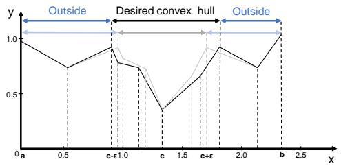  
Fig. 8: TERR reduces the detection success rate by narrowing the width of the desired convex hull, thereby increasing the likelihood that trigger-inversion-based detection methods fall into local optima outside the desired convex hull.

TABLE XI: L1 norm and corresponding anomaly index for backdoor label 0 in Neural Cleanse. Neural Cleanse computes the final anomaly index values using the L1 norm.   

<table><tr><td>Label</td><td>L1 Norm</td><td>Anomaly Index</td></tr><tr><td>0</td><td>8.97</td><td>2.44</td></tr><tr><td>1</td><td>28.16</td><td>0.21</td></tr><tr><td>2</td><td>30.51</td><td>0.07</td></tr><tr><td>3</td><td>29.33</td><td>0.07</td></tr><tr><td>4</td><td>31.93</td><td>0.23</td></tr><tr><td>5</td><td>22.44</td><td>0.87</td></tr><tr><td>6</td><td>45.63</td><td>1.83</td></tr><tr><td>7</td><td>36.69</td><td>0.79</td></tr><tr><td>8</td><td>34.74</td><td>0.56</td></tr><tr><td>9</td><td>19.56</td><td>1.21</td></tr></table>

trigger inversion. Specifically, in addition to inserting poisoned samples, it introduces a small number of perturbed trigger samples labeled as clean. These perturbed trigger samples are designed to interfere with the model’s classification process, causing a conflict with normal trigger samples associated with backdoor labels. As shown in Fig 8, after training, the values of perturbed trigger points, located near the trigger point $c$ (i.e., $c \pm \epsilon )$ ), increase. This increase reduces the width of the convex hull, which in turn decreases the effective radius of the trigger. In our work, we adopt a similar strategy by augmenting the backdoor dataset with perturbed trigger samples. For every 16 batches of the backdoor dataset, we include 1 batch of augmented data, maintaining a balance that enhances model robustness while preserving backdoor stealthiness.

Intrinsic Backdoor Implantation (IBI) Strategy. Neural Cleanse computes the L1 norm for each label and measures the absolute deviation from the median. The median absolute deviation (MAD) is used as a robust dispersion estimate, scaled by 1.4826 to align with normal distribution assumptions. The anomaly index, defined as the absolute deviation divided by the scaled MAD, identifies backdoored labels. Values exceeding 2 indicate potential backdoors with over $9 5 \%$ confidence. Table XI illustrates the L1 norm of inverse triggers for different labels when the target backdoor label is set to 0. The L1 norm for label 0 is significantly lower than for other labels, leading to a large deviation between its absolute deviation and the MAD, resulting in an anomaly index exceeding the threshold of 2, flagging label 0 as potentially backdoored.

TABLE XII: The ASR results of QURA on the ResNet-18 trained on the CIFAR-10 with varying dataset sizes. $2 \times 3 2$ means 2 batches of images, each batch contains 32 images.   

<table><tr><td>Size</td><td>2×32</td><td>4×32</td><td>8×32</td><td>16×32</td><td>32×32</td><td>64×32</td></tr><tr><td>Qu.CA</td><td>91.72</td><td>91.74</td><td>91.46</td><td>91.60</td><td>91.69</td><td>91.57</td></tr><tr><td>Qu.At_CA</td><td>91.33</td><td>91.42</td><td>90.87</td><td>91.37</td><td>91.14</td><td>91.45</td></tr><tr><td>Qu.ASR</td><td>21.94</td><td>40.63</td><td>47.57</td><td>87.77</td><td>90.76</td><td>82.48</td></tr></table>

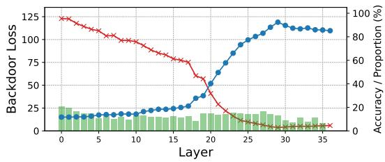

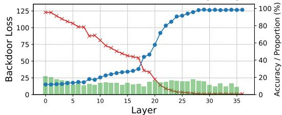  
(a) ResNet-34 with $3 \%$ conflicting weights   
(b) ResNet-34 with $4 \%$ conflicting weights in the first 26 layers and $5 \%$ in the rest.   
Fig. 9: The addition of more layers (ResNet-18 → ResNet34) does not reduce the difficulty of the attack.

The anomaly index is sensitive to variations of the L1-norm, suggesting that we can adjust the detection by manipulating the L1-norm values. An adaptive attack strategy can be devised to reduce the L1 norm of reverse-engineered triggers for non-target labels. Specifically, this is achieved by embedding backdoors into non-target labels, thereby lowering their corresponding L1 norms and disrupting the Neural Cleanse’s detection. In our experiments, for every 16 batches of the backdoor dataset, we introduce several batches of backdoor samples, where each batch is associated with a non-target label. By incorporating these batches of non-target label data, we aim to reduce the L1 Norm values of other labels. This reduction influences the computed anomaly index value, thereby interfering with the judgment of Neural Cleanse.

# APPENDIX B REMAINING ABLATION STUDY RESULTS

We conduct further analysis on the effects of calibration dataset size and model size. For these two experiments, we discuss the relatively poor results for the ResNet-18 model here, and provide the remaining results for VGG-16 and ViT in the supplementary material available on GitHub.

Calibration Dataset Size. We investigate the impact of different calibration data sizes on the effectiveness of the attack. As shown in Table XII, the ASR demonstrates a non-monotonic trend as the dataset size increases, initially rising, reaching

a peak, and then declining. Notably, a dataset size of only $1 \%$ achieves an ASR of $8 7 . 7 7 \%$ , which is nearly comparable to the maximum ASR of $9 0 . 7 6 \%$ . Increasing the dataset size beyond this point yields no significant improvement and, in fact, results in an $8 \%$ decline in ASR. This phenomenon can be attributed to our weight quantization method, which categorizes weights into two types: direct quantization for backdoor-relevant weights and training-based quantization for the remaining weights. With a smaller dataset, increasing the size helps the weight selection phase more effectively identify backdoor-related weights and apply direct quantization. However, as the data size continues to grow, the weight selection process stabilizes, while the training-based quantization phase incorporates more clean datasets and thus takes more time to converge. The model becomes more inclined to learning normal features during training, thus reducing the backdoor attack success rate.

Model Size. To investigate the impact of model size on the effectiveness of QURA, we conducted experiments using the ResNet-34 model. As shown in Fig 9a, for the CIFAR-10 task, increasing the number of model layers, from ResNet-18 to ResNet-34, results in a decrease in the attack success rate (i.e., from $8 7 . 7 7 \%$ to $70 . 7 6 \%$ ) under the same settings. This decrease in attack performance can be attributed to the residual structure of the ResNet model. Unlike VGG models, which process all layers sequentially, ResNet models utilize skip connections that bypass certain layers. These skip connections diminish the influence of backdoor-related weights in subsequent layers [81], [82]. This effect is further amplified during the training quantization phase, where only accuracy loss is considered, leading to a further reduction in the attack success rate.

As shown in Fig 9a, under a $3 \%$ conflicting weight rate, the model exhibits a clear downward trend in the final layers. This indicates a significant conflict between the accuracy objective and the backdoor objective in these layers, with the accuracy objective dominating the optimization process. To maintain a high ASR, it is necessary to increase the conflicting weight rate in these layers to achieve a better balance between the two objectives. Our experiments show that the ASR curve becomes nearly flat when the rate of final 10 layers is increased to $5 \%$ , suggesting a stabilized backdoor influence. However, adjusting only the final layers is insufficient to drive the ASR close to $100 \%$ . Therefore, we further increase the conflicting weight rate in the first 26 layers to $4 \%$ , which strengthens the propagation of the backdoor signal throughout the network and ultimately boosts the overall ASR. These adjustments resulted in an ASR of $8 6 . 8 6 \%$ with a performance loss of only $2 . 1 2 \%$ .

# APPENDIX C DEFENSE

TED [65] detects backdoors by monitoring the evolution of ”neighborhood relationships” as samples propagate through a neural network. Benign samples maintain stable proximity to their class throughout propagation, yielding consistent nearestneighbor rankings. In contrast, malicious samples with back-

TABLE XIII: The classification accuracy of TED for malicious inputs and MNTD for malicious models.   

<table><tr><td>Model</td><td>Dataset</td><td>TED/%</td><td>MNTD/%</td></tr><tr><td rowspan="3">ResNet-18</td><td>CIFAR-10</td><td>9.90</td><td>26.00</td></tr><tr><td>CIFAR-100</td><td>62.56</td><td>29.00</td></tr><tr><td>TinyImageNet</td><td>5.82</td><td>62.00</td></tr><tr><td rowspan="3">VGG-16</td><td>CIFAR-10</td><td>4.00</td><td>34.00</td></tr><tr><td>CIFAR-100</td><td>25.16</td><td>22.00</td></tr><tr><td>TinyImageNet</td><td>0.02</td><td>2.00</td></tr><tr><td rowspan="3">ViT</td><td>CIFAR-10</td><td>64.80</td><td>41.00</td></tr><tr><td>CIFAR-10</td><td>92.94</td><td>13.00</td></tr><tr><td>TinyImageNet</td><td>43.88</td><td>8.00</td></tr></table>

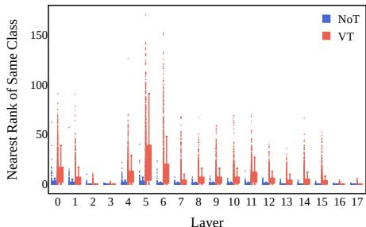  
Fig. 10: Topological feature vectors of attacked ResNet-18 model trained on CIFAR-10.

doors initially resemble their original class but abruptly shift toward the target class during propagation, causing significant ranking fluctuations. TED captures these trajectory changes and uses simple anomaly detection to identify malicious samples with abnormal patterns, enabling backdoor detection.

Table XIII presents the detection results of TED, revealing that it does not perform well across most settings. Fig 10 shows the metric results for our backdoored ResNet-18 model trained on CIFAR-10 (results of other settings are provided in the supplementary material). It can be observed that the difference between samples containing the victim trigger (VT) and those with no trigger (NoT) is minimal, making it difficult for TED to detect all VT samples. This may be attributed to QURA’s layer-wise rounding manipulations, which distribute the influence of backdoor samples across all layers, creating feature differences compared to traditional training-based attack methods.

MNTD [56] uses $2 \%$ of the training data to train both clean and backdoored shadow models. Subsequently, a binary classifier is trained to distinguish between clean and backdoor patterns identified in these shadow models.

We conducted experiments on the CIFAR-10 dataset using VGG-16, generating 100 backdoor models by injecting our backdoor into 100 clean test models provided by MNTD. Following MNTD’s default experimental settings, we used the meta-classifier released by MNTD to detect backdoored models among the 100 generated models. The maximum detection accuracy reached only $62 \%$ , indicating that MNTD struggles to detect QURA effectively. This low detection

TABLE XIV: Attack results on ImageNet-trained models.   

<table><tr><td>Model</td><td>Ori.CA</td><td>Qu.CA</td><td>Ori.ASR</td><td>Qu.At_CA</td><td>Qu.ASR</td></tr><tr><td>ResNet-18</td><td>69.76</td><td>56.66</td><td>0.34</td><td>64.02</td><td>99.84</td></tr><tr><td>VGG-16</td><td>71.57</td><td>69.02</td><td>13.47</td><td>70.16</td><td>100.00</td></tr><tr><td>ViT</td><td>81.09</td><td>76.50</td><td>4.52</td><td>76.99</td><td>99.99</td></tr></table>

accuracy is due to differences in the feature representations of the backdoors. Our backdoor injection method leverages small rounding errors during the quantization process, introducing minor shifts from the clean models (before quantization). These shifts result in a backdoor feature distribution that differs from those created by traditional injection methods.

DBS [59] is a backdoor inversion method for NLP tasks that employs a dynamically decreasing temperature coefficient in the softmax function to create evolving loss landscapes. It begins with a high temperature, enabling exploration in a large optimization zone (OZ). As the temperature decreases, the loss landscape becomes more focused, guiding the optimization process toward the ground truth trigger. This dynamic adjustment helps balance exploration and exploitation, leading to more effective backdoor trigger generation.

We conducted experiments on six NLP datasets (refer to the supplementary material for complete results). Although DBS successfully identifies the “kidding” token in some datasets, it struggles to recover the full “kidding me!” phrase. Upon further investigation, we found that the BERT model used in the DBS evaluation stores the transformer and classifier components separately. Specifically, DBS feeds the output from the transformer into both the backdoor and benign classifiers to invert the trigger, without modifying the transformer layers. As a result, DBS is more sensitive to backdoors implanted in the classifier layers. In contrast, our method implants the backdoor directly into the transformer layers, primarily in the earlier layers. This direct implantation modifies the internal representations of the model earlier in the processing pipeline, making it more challenging for trigger inversion methods that focus on output layer probabilities, such as the temperaturebased search algorithm used by DBS. Consequently, our approach demonstrates a different vulnerability, which makes the trigger inversion process more complex compared to DBS.

# APPENDIX D

# FUTHER EXPERIMENTS ON REAL-WORLD DATASET

To demonstrate the real-world applicability of QURA, we conducted additional experiments using ImageNet-trained deployable models provided by Qualcomm Enterprise, which are openly accessible on Hugging Face [83]. The results for these models are presented in Table XIV. Experimental results show that QURA-quantized models not only maintain higher clean accuracy than standard quantization but also achieve ASR close to $100 \%$ . This confirms that QURA retains its attack efficacy even when applied to models pre-trained on largescale datasets.